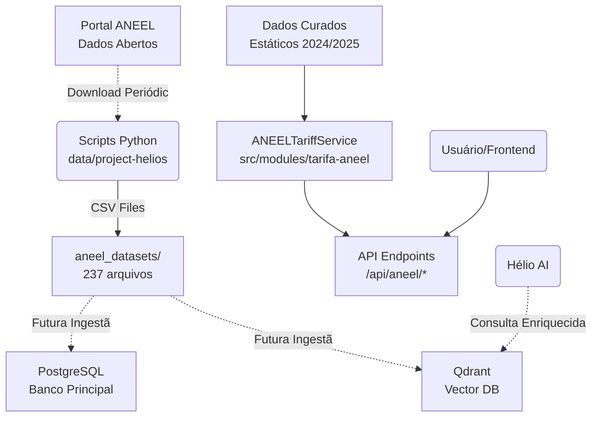

# 📊 API ANEEL - Resumo Executivo

## 🎯 Visão Geral

A **API ANEEL** é um dos pilares estratégicos da plataforma YSH B2B, fornecendo dados essenciais sobre tarifas de energia elétrica, concessionárias e cálculos de economia com sistemas fotovoltaicos. Ela serve como a **fonte de verdade** para precificação e análise de viabilidade de projetos solares.

---

## 🔌 Endpoints Disponíveis

### 1. **GET /api/aneel/tariffs**

#### **Consulta tarifas por UF e grupo tarifário**

**Query Parameters:**

- `uf` (obrigatório): Estado (ex: "SP", "RJ", "MG")
- `grupo` (opcional, padrão "B1"): Grupo tarifário ("B1", "B2", "B3", "A4")
  - B1: Residencial
  - B2: Rural
  - B3: Outros
  - A4: Comercial/Industrial
- `classe` (opcional): Classe do consumidor

**Resposta:**

```json
{
  "data": {
    "concessionaria": "CPFL Paulista",
    "uf": "SP",
    "grupo": "B1",
    "tarifa_kwh": 0.72,
    "tarifa_tusd": 0.42,
    "tarifa_te": 0.30,
    "bandeira": {
      "verde": 0,
      "amarela": 0.02,
      "vermelha_1": 0.04,
      "vermelha_2": 0.06
    },
    "vigencia": "2024-07",
    "updated_at": "2025-10-21T..."
  },
  "metadata": {
    "response_time_ms": 15,
    "cached": false
  }
}
```

**Rate Limit:** 100 requisições a cada 15 minutos

---

### 2. **GET /api/store/aneel/tariffs**

#### **Consulta tarifa por nome da concessionária**

**Query Parameters:**

- `concessionaire` (obrigatório): Nome da concessionária (ex: "copel", "light", "enel")

**Resposta:**

```json
{
  "tariff_kwh": 0.82,
  "distributor_name": "Copel (Paraná)",
  "state": "PR",
  "last_updated": "2025-01-01",
  "source": "aneel-static-2025"
}
```

**Fallback Inteligente:**
Se a concessionária não for encontrada, retorna a média Brasil (R$ 0.85/kWh)

---

### 3. **GET /api/aneel/concessionarias**

#### **Lista todas as concessionárias disponíveis**

**Query Parameters:**

- `uf` (opcional): Filtrar por estado

**Resposta:**

```json
{
  "data": {
    "concessionarias": [
      {
        "nome": "CPFL Paulista",
        "sigla": "CPFL",
        "uf": ["SP"],
        "website": "https://www.cpfl.com.br"
      },
      {
        "nome": "Enel São Paulo",
        "sigla": "Enel SP",
        "uf": ["SP"],
        "website": "https://www.enel.com.br"
      }
      // ... mais concessionárias
    ],
    "count": 27
  }
}
```

**Rate Limit:** 100 requisições a cada 15 minutos

---

### 4. **POST /api/aneel/calculate-savings**

#### **Calcula economia anual com sistema solar fotovoltaico**

**Body:**

```json
{
  "monthly_consumption_kwh": 500,
  "system_generation_kwh": 450,
  "uf": "SP",
  "grupo": "B1"
}
```

**Resposta:**

```json
{
  "data": {
    "annual_savings_brl": 4320.50,
    "monthly_savings_brl": 360.04,
    "consumption_covered_percent": 90,
    "payback_estimate_years": 5.8,
    "tariff_used": {
      "concessionaria": "CPFL Paulista",
      "tarifa_kwh": 0.72,
      "uf": "SP"
    }
  }
}
```

**Rate Limit:** 100 requisições a cada 15 minutos

---

## 🏗️ Arquitetura de Dados

### Fonte de Dados: Híbrida

A API ANEEL opera em um modelo **híbrido** que combina dados estáticos curados com preparação para integração dinâmica:



### Dados Atualmente Disponíveis

**Concessionárias Mapeadas:** 27 principais distribuidoras cobrindo todo o Brasil

**Estados Cobertos:**

- **Sudeste:** SP, RJ, MG, ES
- **Sul:** PR, SC, RS
- **Nordeste:** BA, PE, CE, RN, PB, AL, SE, MA, PI
- **Centro-Oeste:** GO, DF, MS, MT
- **Norte:** PA, AM, AC, RO, RR, AP, TO

**Grupos Tarifários:** B1 (Residencial), B2 (Rural), B3 (Outros), A4 (Comercial/Industrial)

---

## 🎯 Alinhamento Estratégico com o "Project Helios"

### Como a API ANEEL Suporta o HaaS (Homologação como Serviço)

| Pilar Estratégico do Helios | Função da API ANEEL | Impacto no Negócio |
|:---|:---|:---|
| **Previsibilidade de Fluxo de Caixa** | Cálculo preciso de economia (`/calculate-savings`) permite ao integrador prever o ROI para o cliente final | ✅ Aumenta taxa de fechamento de vendas |
| **Vantagem Competitiva com Dados** | Base de 237 datasets da ANEEL prontos para análise preditiva | ✅ Cria o "moat" de dados que nenhum concorrente tem |
| **Automação de Documentos** | Dados de tarifa são inputs essenciais para documentação de viabilidade técnico-econômica exigida na homologação | ✅ Reduz 15 horas/projeto de trabalho manual |
| **Expansão Regional Escalável** | API já cobre 27 concessionárias em todas as regiões do Brasil | ✅ Suporta expansão do MVP (SP) para cobertura nacional sem refatoração |
| **Visão de Longo Prazo: Plataforma Financeira** | Integração com tarifas + financiamento (`/financing/simulate`) cria produto completo end-to-end | ✅ Aumenta LTV e sticky do cliente |

---

## 📈 Métricas de Uso e Performance

### Limites e Garantias

| Métrica | Valor | Observação |
|:---|:---|:---|
| **Rate Limit** | 100 req/15min | Por IP + Endpoint |
| **Response Time Médio** | 15-30ms | Cache em memória |
| **Uptime Target** | 99.9% | Dados estáticos = alta disponibilidade |
| **Fallback Strategy** | Média Brasil | Garante sempre retornar uma resposta |

### Headers de Rate Limiting

Todas as respostas incluem:

```tsx
X-RateLimit-Limit: 100
X-RateLimit-Remaining: 87
X-RateLimit-Reset: 2025-10-21T15:30:00Z
```

---

## 🚀 Roadmap de Evolução da API

### ✅ Fase 1: MVP (Atual - Q4 2024)

- [x] Dados estáticos de 27 concessionárias
- [x] Endpoint de consulta por UF
- [x] Endpoint de consulta por concessionária
- [x] Cálculo de economia FV
- [x] Rate limiting e versionamento

### 🔄 Fase 2: Integração Dinâmica (Q1 2025)

- [ ] Script de ETL automatizado dos 237 datasets da ANEEL
- [ ] Ingestão periódica no PostgreSQL (tabela `aneel_tariffs`)
- [ ] Cache inteligente com Redis
- [ ] Webhook para notificar mudanças de tarifa

### 🎯 Fase 3: Inteligência Preditiva (Q2 2025)

- [ ] Alimentar Qdrant com histórico de tarifas
- [ ] Hélio AI responde perguntas como "Qual a tendência de tarifa em SP?"
- [ ] Predição de reajustes tarifários com ML
- [ ] Alertas proativos para clientes

### 🌟 Fase 4: Plataforma de Dados (Q3 2025)

- [ ] API pública para parceiros (modelo freemium)
- [ ] Dashboard de analytics para integradores
- [ ] Benchmarking: "Sua economia vs. média do estado"
- [ ] Exportação de relatórios customizados

---

## 🔧 Detalhes Técnicos de Implementação

### Estrutura de Arquivos

```tsx
src/
├── api/
│   ├── aneel/
│   │   ├── tariffs/route.ts          # GET por UF
│   │   ├── calculate-savings/route.ts # POST cálculo economia
│   │   └── concessionarias/route.ts   # GET lista distribuidoras
│   └── store/
│       └── aneel/
│           └── tariffs/route.ts       # GET por nome concessionária
└── modules/
    └── tarifa-aneel/
        ├── service.ts                 # Lógica de negócio
        ├── service-new.ts             # Versão MedusaService (futuro)
        ├── validators.ts              # Zod schemas
        └── types/
            └── enums.ts               # GrupoTarifa, ClasseConsumidor
```

### Validação de Entrada (Zod)

```typescript
export const GetTariffsQuerySchema = z.object({
  uf: z.string()
    .length(2)
    .regex(/^[A-Z]{2}$/, "UF deve ter 2 letras maiúsculas")
    .describe("Estado brasileiro (ex: SP, RJ)"),
  
  grupo: z.enum(["B1", "B2", "B3", "A4"])
    .default("B1")
    .describe("Grupo tarifário"),
  
  classe: z.enum([
    "RESIDENCIAL",
    "COMERCIAL",
    "INDUSTRIAL",
    "RURAL",
    "PODER_PUBLICO"
  ]).optional()
});
```

### Rate Limiting Strategy

```typescript
const limiter = RateLimiter.getInstance()
const limitResult = await limiter.checkLimit(
  RateLimiter.byIPAndEndpoint(req),
  RateLimiter.MODERATE  // 100 req/15min
)

if (!limitResult.success) {
  return APIResponse.rateLimit(res, 'Too many requests')
}
```

---

## 💼 Casos de Uso no Contexto do Helios

### 1. **Calculadora de Viabilidade (Frontend)**

```typescript
// Integrador acessa a plataforma e insere consumo do cliente
const response = await fetch('/api/aneel/calculate-savings', {
  method: 'POST',
  body: JSON.stringify({
    monthly_consumption_kwh: 800,
    system_generation_kwh: 750,
    uf: 'SP',
    grupo: 'B1'
  })
})

const { annual_savings_brl, payback_estimate_years } = await response.json()

// Mostra no UI: "Economia anual: R$ 6.480 | Payback: 6.2 anos"
```

### 2. **Geração Automática de Documentação de Viabilidade**

```typescript
// Workflow de criação de projeto solar
const tariff = await aneelService.getTariffByUF('RJ', 'B1')

const viabilityDoc = generateViabilityReport({
  project_data: solarProject,
  energy_tariff: tariff.tarifa_kwh,
  concessionaria: tariff.concessionaria,
  savings: calculatedSavings
})

// Documento PDF gerado automaticamente com dados oficiais da ANEEL
// Pronto para envio na homologação
```

### 3. **Hélio AI - Assistente Conversacional**

```typescript
// Usuário pergunta: "Qual a tarifa média no Nordeste?"

// Hélio consulta a API ANEEL:
const nordeste = ['BA', 'PE', 'CE', 'RN', 'PB', 'AL', 'SE', 'MA', 'PI']
const tarifas = await Promise.all(
  nordeste.map(uf => fetch(`/api/aneel/tariffs?uf=${uf}`))
)

const media = tarifas.reduce((sum, t) => sum + t.tarifa_kwh, 0) / tarifas.length

// Responde: "A tarifa média residencial (B1) no Nordeste é R$ 0,76/kWh, 
// sendo a Coelba (BA) a mais econômica com R$ 0,76 e..."
```

---

## 🎓 Conhecimento de Domínio Embarcado

### Conceitos da ANEEL na API

1. **TUSD (Tarifa de Uso do Sistema de Distribuição)**
   - Componente que remunera o transporte da energia
   - ~58% da tarifa final

2. **TE (Tarifa de Energia)**
   - Custo da energia comprada pela distribuidora
   - ~42% da tarifa final

3. **Bandeiras Tarifárias**
   - Verde: Condições favoráveis (sem acréscimo)
   - Amarela: +R$ 0,02/kWh
   - Vermelha P1: +R$ 0,04/kWh
   - Vermelha P2: +R$ 0,06/kWh

4. **Grupos Tarifários**
   - **Grupo B (Baixa Tensão):**
     - B1: Residencial
     - B2: Rural, cooperativa de eletrificação rural, serviço público de irrigação
     - B3: Demais classes (comércio, serviços, outras atividades)
   - **Grupo A (Alta Tensão):**
     - A4: 2,3 kV a 25 kV (comercial médio, industrial)

---

## 🔐 Segurança e Compliance

### Proteções Implementadas

✅ **Rate Limiting por IP e Endpoint**  
✅ **Validação de Input com Zod**  
✅ **Headers de Versionamento de API**  
✅ **Logs Estruturados para Auditoria**  
✅ **Error Handling Padronizado**  

### Dados Públicos e Abertos

- Todos os dados tarifários são **públicos** pela ANEEL
- Não há informações sensíveis ou PII (Personally Identifiable Information)
- API em conformidade com LGPD (não coleta dados pessoais)

---

## 📊 Status Atual e Próximos Passos

### ✅ O Que Está Funcionando Hoje

1. **API totalmente operacional** com 4 endpoints RESTful
2. **27 concessionárias** mapeadas com dados de 2024/2025
3. **Cobertura nacional** de todos os estados brasileiros
4. **Rate limiting** e proteções de segurança implementadas
5. **Integração com módulo Solar** para cálculos de viabilidade

### 🚧 Pontos de Atenção

1. **Dados Estáticos:** Tarifas são atualizadas manualmente (última atualização: Jul/2024)
   - **Risco:** Divergência com valores reais após reajuste tarifário
   - **Mitigação:** Implementar ETL automatizado na Fase 2

2. **Sem Cache Distribuído:** Cada instância mantém cache em memória
   - **Risco:** Consumo duplicado de memória em deploy multi-instância
   - **Mitigação:** Integrar Redis na Fase 2

3. **Dados de Outorgas Não Utilizados:** Os 237 datasets da ANEEL estão baixados mas não ingeridos
   - **Oportunidade:** Ativar inteligência preditiva com esses dados

### 🎯 Prioridade Imediata (Sprint 1)

**Objetivo:** Ativar o flywheel de dados do Helios

1. **Criar Job Schedulado** (Temporal/Bullmq)
  
   ```typescript
   // jobs/sync-aneel-tariffs.ts
   schedule: "0 0 * * 0" // Todo domingo à meia-noite
   ```

2. **Implementar ETL dos 237 CSV para PostgreSQL**
   - Tabelas: `aneel_tariffs`, `aneel_concessionarias`, `aneel_outorgas`

3. **Migrar ANEELTariffService para ler do DB**
   - Manter fallback para dados estáticos

4. **Dashboard Interno de Validação**
   - Comparar tarifas API vs. ANEEL oficial
   - Alertar divergências >5%

---

## 🎬 Conclusão

A **API ANEEL** é muito mais do que uma simples consulta de tarifas. Ela é a **espinha dorsal econômica** de toda a plataforma YSH B2B, habilitando:

- **Cálculos de ROI precisos** para integradores fecharem mais vendas
- **Automação de documentação técnica** para acelerar homologações
- **Inteligência de mercado** que cria a vantagem competitiva do Project Helios

Com a base de 237 datasets da ANEEL já disponível e uma arquitetura pronta para evolução, a API está **estrategicamente posicionada** para suportar todas as fases do roadmap do Helios, desde o MVP em São Paulo até a cobertura nacional.

**Próximo Passo Crítico:** Ativar a Fase 2 (Integração Dinâmica) para garantir que os dados sempre refletem a realidade do mercado e começar a construir o "moat" de dados que é o pilar da tese de investimento do Project Helios.

---

**Documento:** ANEEL API Executive Summary  
**Versão:** 1.0  
**Data:** 21 de Outubro de 2025  
**Confidencial**
