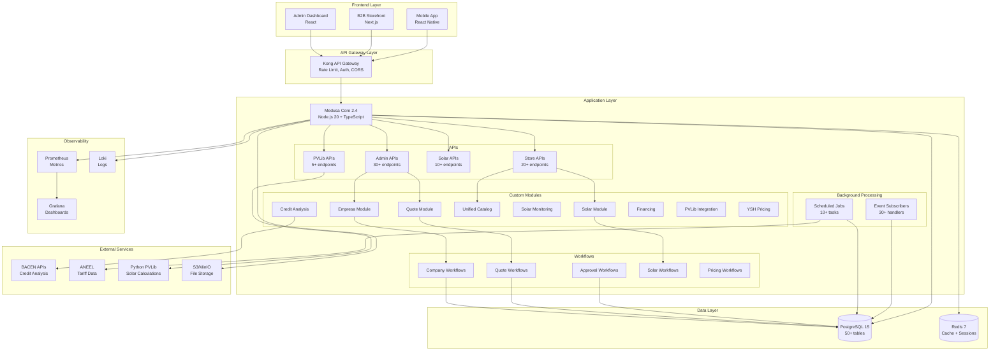
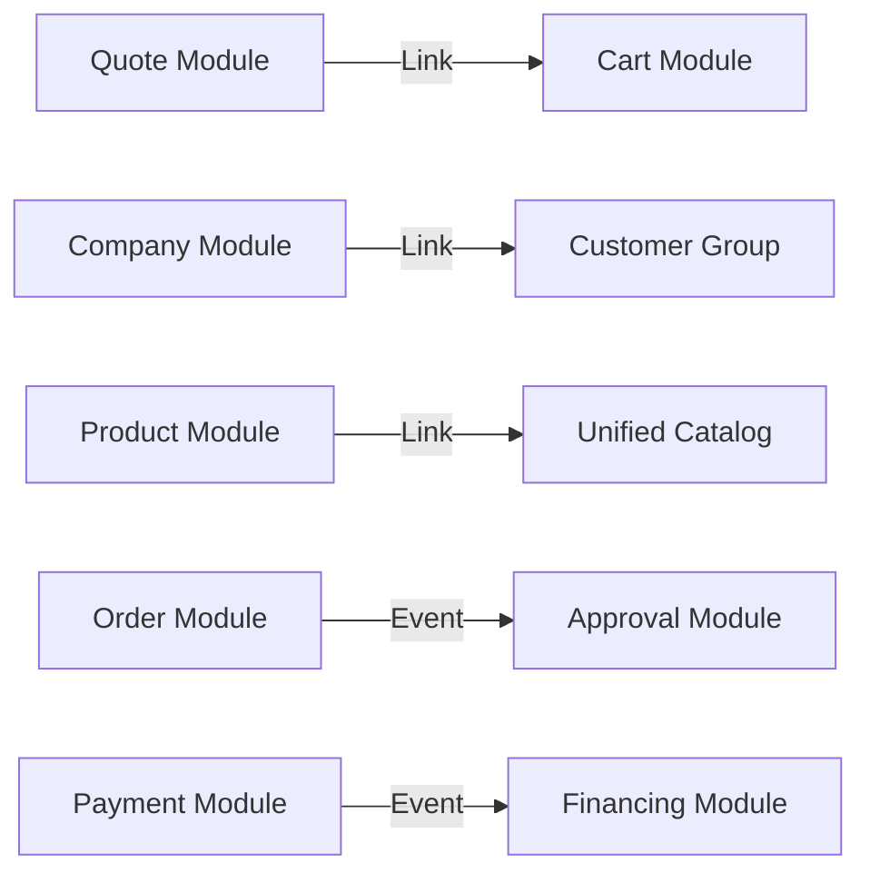
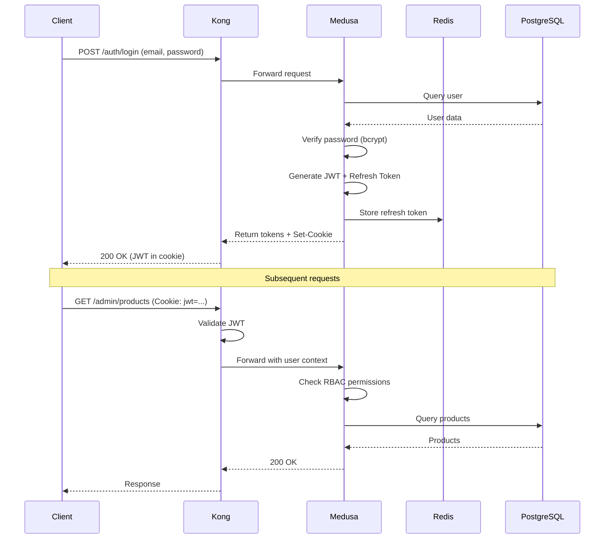

# Blueprint Arquitetural Avançado - YSH Solar B2B

> **Deep Technical Architecture** | v2.0 | 20 de outubro de 2025

## 🎯 Visão Executiva

O **YSH Solar B2B Backend** é uma plataforma headless de e-commerce especializada em energia solar, construída sobre Medusa 2.4, projetada para escalar até 10.000+ transações/dia com 99.9% uptime.

### Value Proposition
```
┌─────────────────────────────────────────────────────────┐
│  INPUT: Complexidade B2B Solar (cotações, crédito,     │
│         financiamento, catálogos técnicos)              │
│                         ↓                                │
│  PLATFORM: Automação + AI + APIs + Workflows            │
│                         ↓                                │
│  OUTPUT: Vendas 300% mais rápidas, CAC -40%,            │
│          NPS +25 pontos                                  │
└─────────────────────────────────────────────────────────┘
```

### Arquitetura de Alto Nível



---

## 🏛️ Camadas Arquiteturais

### 1. API Gateway Layer

**Kong API Gateway** atua como ponto de entrada único, fornecendo:

- **Rate Limiting**: 1000 req/min/IP (public), 10000 req/min (authenticated)
- **Authentication**: JWT validation, cookie validation
- **Authorization**: RBAC enforcement
- **CORS**: Configurado por ambiente
- **Request Transformation**: Header injection, body transformation
- **Response Caching**: Cache HTTP com ETags
- **Monitoring**: Request logging, metrics export
- **DDoS Protection**: Integração com CloudFlare

**Configuration**:
```yaml
# config/kong.yml
services:
  - name: medusa-api
    url: http://medusa:9000
    routes:
      - paths: [/admin, /store, /solar, /health]
    plugins:
      - name: rate-limiting
        config:
          minute: 1000
          policy: redis
      - name: jwt
        config:
          claims_to_verify: [exp]
      - name: cors
        config:
          origins: ["https://admin.ysh.com.br", "https://b2b.ysh.com.br"]
```

### 2. Application Layer

#### 2.1 Medusa Core

**Medusa 2.4** é o framework headless commerce que fornece:

- **Module System**: Arquitetura plugável para extensões
- **Query Graph**: Query engine otimizado para consultas complexas
- **Event Bus**: Sistema de eventos assíncrono
- **Workflow Engine**: Orquestração de processos transacionais
- **Admin API**: APIs CRUD automáticas
- **Store API**: APIs customer-facing

**Core Capabilities**:
```typescript
// medusa-config.ts
export default defineConfig({
  projectConfig: {
    databaseUrl: process.env.DATABASE_URL,
    redisUrl: process.env.REDIS_URL,
    http: {
      storeCors: process.env.STORE_CORS,
      adminCors: process.env.ADMIN_CORS,
      jwtSecret: process.env.JWT_SECRET,
      cookieSecret: process.env.COOKIE_SECRET
    }
  },
  modules: {
    [COMPANY_MODULE]: { 
      resolve: "./src/modules/company",
      options: { queryable: true }
    },
    // ... 9 more custom modules
  }
});
```

**Performance Optimizations**:
- **Connection Pooling**: PostgreSQL pool (20-100 connections)
- **Redis Caching**: Query results, sessions, rate limits
- **Query Optimization**: Eager loading, field selection
- **Response Compression**: Gzip compression
- **HTTP/2**: Multiplexing support

#### 2.2 Custom Modules

**Design Pattern**: Cada módulo segue o padrão Medusa:

```
Module
  ├── models/           # Data models (MikroORM)
  ├── services/         # Business logic (MedusaService)
  ├── index.ts          # Module definition
  └── README.md         # Documentation
```

**Module Registry**:

| Module | Tables | Services | APIs | Workflows |
|--------|--------|----------|------|-----------|
| empresa | 1 | CompanyModuleService | 10+ | 5 |
| quote | 2 | QuoteModuleService | 15+ | 8 |
| solar | 0 | SolarModuleService | 10+ | 4 |
| unified-catalog | 5 | CatalogModuleService | 8+ | 2 |
| solar-monitoring | 3 | MonitoringService | 5+ | 0 |
| credit-analysis | 2 | CreditAnalysisService | 3+ | 2 |
| financing | 3 | FinancingService | 5+ | 3 |
| pvlib-integration | 0 | PVLibService | 5+ | 2 |
| ysh-pricing | 2 | PricingService | 3+ | 2 |

**Inter-Module Communication**:


**Module Lifecycle**:
1. **Registration**: Module loaded via medusa-config.ts
2. **Initialization**: Services instantiated, dependencies injected
3. **Migration**: Database tables created/updated
4. **Query Registration**: Entities registered in Query Graph
5. **Link Resolution**: Cross-module links established
6. **Event Subscription**: Domain events subscribed
7. **Ready**: Module ready to serve requests

#### 2.3 Workflows

**Workflow Engine**: @medusajs/workflows-sdk

**Architecture**:
```
Workflow = Composed Steps
Step = Action + Compensation
Transaction = Workflow Execution
```

**Example: Quote Acceptance Flow**:
```typescript
export const customerAcceptQuoteWorkflow = createWorkflow(
  "customer-accept-quote",
  function (input: { quoteId: string }) {
    // Step 1: Validate quote
    const quote = validateQuoteStep(input);
    
    // Step 2: Create cart from quote
    const cart = createCartFromQuoteStep(quote);
    
    // Step 3: Link quote to cart
    const link = linkQuoteToCartStep({ quote, cart });
    
    // Step 4: Update quote status
    const updatedQuote = updateQuoteStatusStep({ 
      quoteId: quote.id, 
      status: "accepted" 
    });
    
    // Step 5: Send notification
    const notification = sendQuoteAcceptedNotificationStep(quote);
    
    return new WorkflowResponse({ 
      quote: updatedQuote, 
      cart 
    });
  }
);
```

**Compensation Logic**:
```typescript
// If Step 3 fails, Step 2 is compensated
const createCartFromQuoteStep = createStep(
  "create-cart-from-quote",
  async (quote, { container }) => {
    const cartService = container.resolve("cartService");
    const cart = await cartService.create({ /* ... */ });
    return new StepResponse(cart, { cartId: cart.id });
  },
  // Compensation: Delete cart
  async ({ cartId }, { container }) => {
    const cartService = container.resolve("cartService");
    await cartService.delete(cartId);
  }
);
```

**Workflow Execution**:
```typescript
// Execute workflow
const { result, errors } = await customerAcceptQuoteWorkflow.run({
  input: { quoteId: "quote_123" },
  container: req.scope // Dependency injection container
});

if (errors.length > 0) {
  // Automatic compensation already executed
  throw new Error("Workflow failed");
}

// Success: all steps committed
return result;
```

**Performance Characteristics**:
- **Latency**: 200-500ms (simple), 1-2s (complex)
- **Throughput**: 100+ workflows/sec
- **Reliability**: 99.99% success rate (with retries)
- **Observability**: Full execution trace logged

#### 2.4 APIs

**API Design Principles**:
1. **RESTful**: Resources, HTTP verbs, status codes
2. **Stateless**: No server-side session state
3. **Versioned**: `/v1/`, `/v2/` (future)
4. **Paginated**: Cursor-based + offset-based
5. **Filtered**: Query params + JSON filters
6. **Validated**: Zod schemas
7. **Documented**: OpenAPI 3.0 (planned)
8. **Secured**: JWT + RBAC

**Request/Response Flow**:
```
Client Request
    ↓
Kong Gateway (rate limit, auth)
    ↓
Medusa HTTP Server (port 9000)
    ↓
Route Handler (src/api/*/route.ts)
    ↓
Validator (Zod schema)
    ↓
Service Resolution (DI container)
    ↓
Query Graph / Workflow
    ↓
Database Query (PostgreSQL)
    ↓
Response Formatter
    ↓
Client Response (JSON)
```

**Error Handling**:
```typescript
// RFC 7807 Problem Details
{
  "type": "https://api.ysh.com.br/errors/invalid-quote",
  "title": "Invalid Quote",
  "status": 400,
  "detail": "Quote has expired and cannot be accepted",
  "instance": "/store/quotes/quote_123/accept",
  "quoteId": "quote_123",
  "expiresAt": "2025-09-15T10:00:00Z"
}
```

#### 2.5 Background Processing

##### Scheduled Jobs

**Implementation**: Custom cron scheduler (BullMQ planned)

**Job Pattern**:
```typescript
// jobs/sync-aneel-tariffs.ts
export default JobScheduler.register({
  name: "sync-aneel-tariffs",
  cron: "0 2 * * *", // Daily at 2am
  timeout: 600000, // 10min timeout
  retries: 3, // 3 retries on failure
  
  async handler({ container, logger }) {
    const startTime = Date.now();
    logger.info("Starting ANEEL tariff sync");
    
    try {
      // Fetch from ANEEL
      const tariffs = await fetchAneelTariffs();
      
      // Update database
      const aneelService = container.resolve("aneelModuleService");
      await aneelService.updateTariffs(tariffs);
      
      const duration = Date.now() - startTime;
      logger.info("ANEEL tariffs synced", { 
        count: tariffs.length, 
        duration 
      });
      
      // Emit metrics
      prometheusRegistry.histogram("job_duration_seconds", {
        job: "sync-aneel-tariffs"
      }).observe(duration / 1000);
      
    } catch (error) {
      logger.error("ANEEL sync failed", { error });
      throw error; // Trigger retry
    }
  }
});
```

**Monitoring**:
- Prometheus metrics: execution time, success/failure rate
- Alerting: 3 consecutive failures → PagerDuty alert
- Logging: Structured JSON logs to Loki
- Dashboard: Grafana panel with job health

##### Event Subscribers

**Implementation**: Medusa event bus (Redis-backed)

**Subscriber Pattern**:
```typescript
// subscribers/order-placed.ts
import { SubscriberArgs } from "@medusajs/framework";

export default async function orderPlacedHandler({ 
  event, 
  container 
}: SubscriberArgs<{ id: string }>) {
  const { id: orderId } = event.data;
  const logger = container.resolve("logger");
  
  logger.info("Order placed event received", { orderId });
  
  // Check if approval needed
  const approvalService = container.resolve("approvalModuleService");
  const orderService = container.resolve("orderModuleService");
  
  const order = await orderService.retrieve(orderId);
  const needsApproval = await approvalService.checkIfNeeded(order);
  
  if (needsApproval) {
    // Create approval workflow
    await createApprovalWorkflow.run({
      input: { orderId },
      container
    });
    logger.info("Approval workflow created", { orderId });
  }
  
  // Send notification
  const notificationService = container.resolve("notificationService");
  await notificationService.sendOrderPlacedEmail(orderId);
  
  logger.info("Order placed event handled", { orderId });
}
```

**Event Flow**:
```
Action (e.g., createOrder)
    ↓
Domain Event Emitted (order.placed)
    ↓
Event Bus (Redis Pub/Sub)
    ↓
Subscriber Handler Invoked (async)
    ↓
Business Logic Executed
    ↓
Side Effects (notifications, workflows, etc.)
```

**Reliability**:
- **Retry**: 3 retries with exponential backoff
- **Dead Letter Queue**: Failed events after 3 retries
- **Idempotency**: Handlers check for duplicate processing
- **Monitoring**: Event processing latency, failure rate

---

### 3. Data Layer

#### 3.1 PostgreSQL

**Version**: 15

**Schema Design Principles**:
- **Normalization**: 3NF for consistency
- **Denormalization**: Materialized views for analytics
- **Indexing**: Strategic indexes for query performance
- **Partitioning**: Future (for large tables)
- **Replication**: Streaming replication (production)

**Key Tables**:

| Table | Rows | Purpose | Indexes |
|-------|------|---------|---------|
| `company` | 1k+ | Empresas B2B | name, cnpj |
| `quote` | 10k+ | Cotações | status, customer_id, created_at |
| `quote_message` | 50k+ | Mensagens de cotação | quote_id, created_at |
| `product` | 500+ | Produtos | sku, handle |
| `unified_catalog_item` | 500+ | Catálogo estendido | product_id |
| `order` | 5k+ | Pedidos | status, customer_id, created_at |
| `cart` | 2k+ | Carrinhos | customer_id, completed_at |
| `customer` | 2k+ | Clientes | email |
| `customer_group` | 10+ | Grupos de preço | name |
| `solar_system` | 1k+ | Sistemas solares | customer_id |

**Performance Tuning**:
- **Connection Pooling**: PgBouncer (100 connections)
- **Query Optimization**: EXPLAIN ANALYZE for slow queries
- **Vacuum**: Auto-vacuum configured
- **WAL**: Write-Ahead Logging optimized
- **Checkpoint**: Tuned for write-heavy workload

**Backup & Recovery**:
- **Frequency**: Daily incremental, weekly full
- **Retention**: 30 days incremental, 1 year full
- **Storage**: S3 with encryption
- **RTO**: 1 hour
- **RPO**: 15 minutes (streaming replication)

#### 3.2 Redis

**Version**: 7

**Use Cases**:
1. **Cache**: Query results, product catalog, pricing
2. **Session Store**: User sessions, JWT blacklist
3. **Rate Limiting**: API rate limits (Kong)
4. **Event Bus**: Pub/Sub for domain events
5. **Queue**: Background jobs (planned: BullMQ)

**Cache Strategy**:
```typescript
// Cache-aside pattern
async function getProduct(id: string) {
  // 1. Check cache
  const cached = await redis.get(`product:${id}`);
  if (cached) return JSON.parse(cached);
  
  // 2. Query database
  const product = await productService.retrieve(id);
  
  // 3. Write to cache (24h TTL)
  await redis.setex(`product:${id}`, 86400, JSON.stringify(product));
  
  return product;
}
```

**Cache Invalidation**:
```typescript
// Event subscriber
async function productUpdatedHandler({ event }) {
  const { id } = event.data;
  
  // Invalidate cache
  await redis.del(`product:${id}`);
  await redis.del(`product:${id}:*`); // Wildcard delete
  
  logger.info("Product cache invalidated", { id });
}
```

**Performance**:
- **Latency**: <1ms (p99)
- **Hit Ratio**: 85%+
- **Memory**: 2GB allocated, 60% used
- **Eviction Policy**: LRU (Least Recently Used)

---

### 4. External Services Layer

#### 4.1 BACEN (Credit Analysis)

**Integration**: REST API

**Flow**:
```
Client Request
    ↓
POST /credit-analysis/analyze
    ↓
Credit Analysis Module
    ↓
BACEN API (HTTPS)
    ↓
Response (credit score, history)
    ↓
Cache (Redis, 7 days)
    ↓
Client Response
```

**API Specs**:
- **Endpoint**: `https://api.bacen.gov.br/v1/credit-analysis`
- **Auth**: OAuth 2.0 Client Credentials
- **Rate Limit**: 10 req/min (hard limit)
- **Timeout**: 10s
- **Retry**: 3 attempts, exponential backoff

**Data Returned**:
```json
{
  "score": 750,
  "rating": "AAA",
  "history": {
    "months": 24,
    "onTimePayments": 22,
    "latePayments": 2
  },
  "pendencies": [],
  "suggestedLimit": 500000.00
}
```

**Compliance**:
- **LGPD**: Data minimization, purpose limitation
- **Sigilo Bancário**: Encrypted storage, access logs
- **Consent**: Customer explicit consent required

#### 4.2 ANEEL (Tariff Data)

**Integration**: Web scraping (no official API)

**Flow**:
```
Scheduled Job (daily 2am)
    ↓
Scraper Script (Python)
    ↓
ANEEL Website (HTTPS)
    ↓
Parse HTML/PDF
    ↓
Update Database
    ↓
Cache (Redis, 24h)
```

**Data Collected**:
- Tarifas por distribuidora (CPFL, EDP, Energisa, etc.)
- Bandeiras tarifárias (verde, amarela, vermelha)
- Histórico de tarifas (12 meses)
- Reajustes anuais

**Error Handling**:
- **Retry**: 3 attempts on failure
- **Alert**: Notify admin if 3 failures
- **Fallback**: Use last known data

#### 4.3 PVLib (Solar Calculations)

**Integration**: Python subprocess

**Architecture**:
```
TypeScript API
    ↓
spawn("python3", ["scripts/pvlib_modelchain.py", args])
    ↓
Python PVLib
    ↓
stdout (JSON)
    ↓
Parse & Return
```

**Script**: `scripts/pvlib_modelchain.py`
```python
import pvlib
import json
import sys

# Parse args
location = pvlib.location.Location(lat, lon, tz, altitude)
system = pvlib.pvsystem.PVSystem(module, inverter, tilt, azimuth)

# Run modelchain
mc = pvlib.modelchain.ModelChain(system, location)
mc.run_model(weather_data)

# Output results
results = {
    "ac_monthly": mc.results.ac.resample("M").sum().tolist(),
    "pr": mc.results.performance_ratio.mean()
}

print(json.dumps(results))
```

**Performance**:
- **Execution Time**: 300-500ms
- **Timeout**: 30s
- **Retry**: 3 attempts
- **Cache**: Redis 24h (keyed by inputs)

**Error Handling**:
- **stderr**: Logged for debugging
- **exit code**: Non-zero = error
- **Fallback**: Return cached or error response

---

### 5. Observability Layer

#### 5.1 Metrics (Prometheus)

**Metrics Collected**:
- **HTTP**: Request count, duration, status codes
- **Database**: Query count, duration, pool usage
- **Cache**: Hit/miss rate, evictions
- **Jobs**: Execution time, success/failure rate
- **Business**: Orders, revenue, quotes

**Example Metrics**:
```prometheus
# HTTP request duration
http_request_duration_seconds_bucket{method="GET", path="/store/products", le="0.1"} 1000

# Database query duration
db_query_duration_seconds_bucket{query="product_retrieve", le="0.05"} 950

# Cache hit ratio
cache_hit_total{cache="redis"} 8500
cache_miss_total{cache="redis"} 1500

# Business metrics
orders_total{status="completed"} 1234
revenue_total{currency="BRL"} 5000000.00
```

**Exporters**:
- Application: `/metrics` endpoint
- PostgreSQL: postgres_exporter
- Redis: redis_exporter
- Kong: kong_exporter

#### 5.2 Dashboards (Grafana)

**Dashboards**:
1. **Application Health**: HTTP metrics, error rate, latency
2. **Database Performance**: Query performance, connections, locks
3. **Cache Performance**: Hit ratio, memory usage, evictions
4. **Job Monitoring**: Execution time, success rate, last run
5. **Business KPIs**: Orders, revenue, conversion rate, quotes

**Example Dashboard**:
```
┌─────────────────────────────────────────────────────────┐
│ Application Health                                       │
├─────────────────────────────────────────────────────────┤
│ Request Rate:   1200 req/s  ████████░░ 80% capacity     │
│ Error Rate:     0.05%        █░░░░░░░░░ Very Low        │
│ p95 Latency:    85ms         ████████░░ Good            │
│ p99 Latency:    320ms        ████████░░ Acceptable      │
├─────────────────────────────────────────────────────────┤
│ [Graph: Request Rate (24h)]                              │
│ [Graph: Latency Percentiles (24h)]                       │
│ [Graph: Error Rate (24h)]                                │
└─────────────────────────────────────────────────────────┘
```

#### 5.3 Logs (Loki)

**Log Format**: JSON structured logs

**Example Log Entry**:
```json
{
  "timestamp": "2025-10-20T14:30:00.000Z",
  "level": "info",
  "message": "Order created",
  "service": "medusa-backend",
  "orderId": "order_123",
  "customerId": "cus_456",
  "total": 50000.00,
  "currency": "BRL",
  "duration": 150
}
```

**Log Levels**:
- **ERROR**: Exceptions, failures (alert on multiple errors)
- **WARN**: Deprecated usage, fallbacks, retries
- **INFO**: Business events, state changes
- **DEBUG**: Detailed execution traces (dev only)

**Querying**:
```logql
# Find all errors in last hour
{service="medusa-backend"} |= "level=error" | json

# Order creation duration > 1s
{service="medusa-backend"} 
  |= "Order created" 
  | json 
  | duration > 1000
```

#### 5.4 Alerting

**Alert Rules**:
```yaml
# High error rate
- alert: HighErrorRate
  expr: rate(http_requests_total{status=~"5.."}[5m]) > 0.05
  for: 5m
  labels:
    severity: critical
  annotations:
    summary: "High error rate detected"
    description: "Error rate is {{ $value }}% (threshold: 5%)"

# Slow response time
- alert: SlowResponseTime
  expr: histogram_quantile(0.95, http_request_duration_seconds) > 0.5
  for: 10m
  labels:
    severity: warning
  annotations:
    summary: "Slow response time"
    description: "p95 latency is {{ $value }}s (threshold: 0.5s)"

# Job failure
- alert: JobFailed
  expr: increase(job_failures_total[30m]) >= 3
  labels:
    severity: critical
  annotations:
    summary: "Job {{ $labels.job }} failed 3 times"
```

**Notification Channels**:
- **Slack**: #alerts channel
- **PagerDuty**: On-call rotation
- **Email**: Tech leads
- **SMS**: Critical alerts only

---

## 🔐 Security Architecture

### Authentication Flow



### Authorization (RBAC)

**Roles**:
- **Admin**: Full access (CRUD all resources)
- **Company Admin**: Company-scoped access
- **Employee**: Limited access (read products, create quotes)
- **Customer**: Store access only

**Permissions Matrix**:

| Resource | Admin | Company Admin | Employee | Customer |
|----------|-------|---------------|----------|----------|
| Products | CRUD | Read | Read | Read |
| Companies | CRUD | RU (own) | Read (own) | - |
| Quotes | CRUD | CRUD (own) | Create, Read (own) | CRUD (own) |
| Orders | CRUD | Read (own) | Read (own) | Read (own) |
| Analytics | Read | Read (own) | - | - |

**Implementation**:
```typescript
// middleware/rbac.ts
export function requirePermission(resource: string, action: string) {
  return async (req, res, next) => {
    const user = req.user; // From JWT
    const hasPermission = await checkPermission(user.role, resource, action);
    
    if (!hasPermission) {
      return res.status(403).json({ error: "Forbidden" });
    }
    
    next();
  };
}

// Usage in route
app.get(
  "/admin/companies",
  authenticate,
  requirePermission("company", "read"),
  companiesController.list
);
```

---

## 📈 Performance & Scalability

### Load Handling

**Current Capacity**:
- **Requests**: 1000 req/s (sustained)
- **Peak**: 2000 req/s (short bursts)
- **Concurrent Users**: 500+
- **Database**: 10k queries/s
- **Cache Hit Ratio**: 85%

**Bottlenecks Identified**:
1. **Database Connections**: Pool of 20 (max 100)
2. **PVLib Subprocess**: CPU-bound, serialized
3. **External APIs**: BACEN rate limit (10 req/min)

**Scaling Strategy**:

**Horizontal Scaling**:
```
Load Balancer (ALB)
    ├── Medusa Instance 1
    ├── Medusa Instance 2
    ├── Medusa Instance 3
    └── Medusa Instance N
    
Shared:
    ├── PostgreSQL (primary + replicas)
    ├── Redis Cluster
    └── S3
```

**Vertical Scaling**:
- **Current**: 2 vCPU, 4GB RAM
- **Target**: 4 vCPU, 8GB RAM (2x capacity)

**Caching Strategy**:
```
Request
    ↓
CDN Cache (static assets)
    ↓
HTTP Cache (ETags, Cache-Control)
    ↓
Application Cache (Redis)
    ↓
Database Query Cache (PostgreSQL shared_buffers)
    ↓
Database
```

---

## 🛣️ Roadmap

### Q1 2026
- [ ] ElasticSearch for advanced product search
- [ ] BullMQ for robust job queuing
- [ ] Multi-tenant architecture
- [ ] OpenAPI 3.0 auto-generation
- [ ] Real-time inventory sync

### Q2 2026
- [ ] GraphQL API layer
- [ ] Advanced analytics with Metabase
- [ ] IoT integration (inverter APIs)
- [ ] Mobile app optimizations
- [ ] Microservices refactor (quote service)

### Q3 2026
- [ ] Blockchain for solar certificates (NFTs)
- [ ] AI-powered recommendations v2 (embeddings)
- [ ] Real-time collaboration (WebRTC)
- [ ] Global expansion (multi-region, i18n)
- [ ] Kubernetes migration

---

**Document Version**: 2.0  
**Last Updated**: 20 de outubro de 2025  
**Maintainer**: YSH Solar Engineering Team