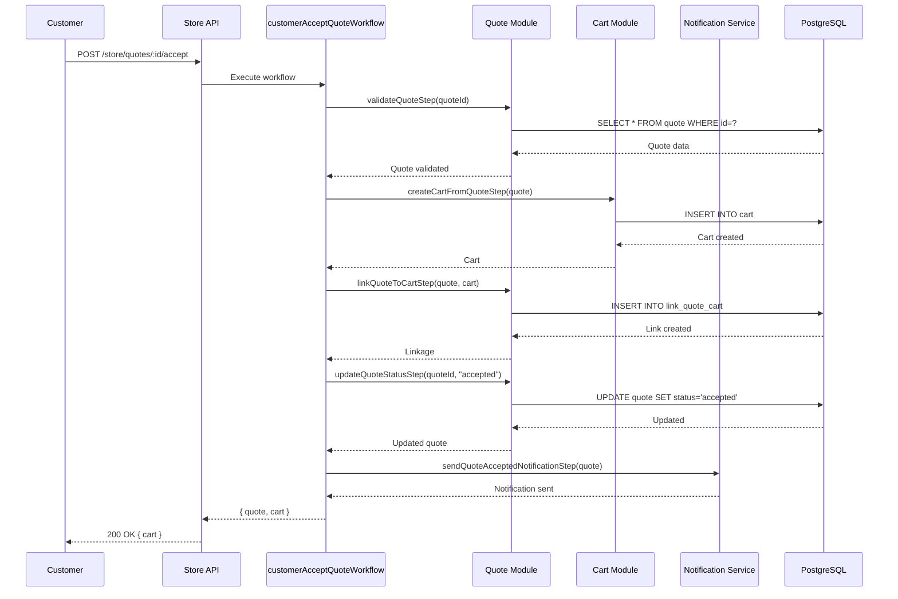
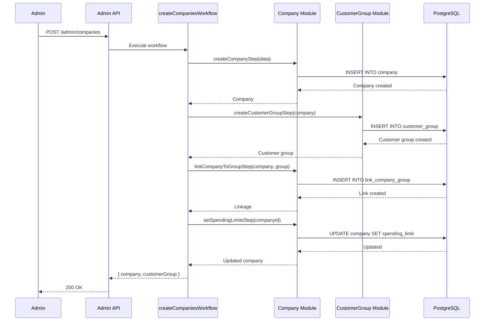
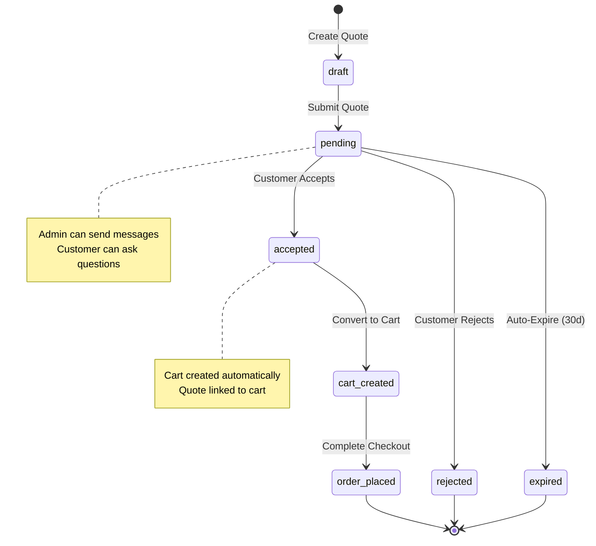
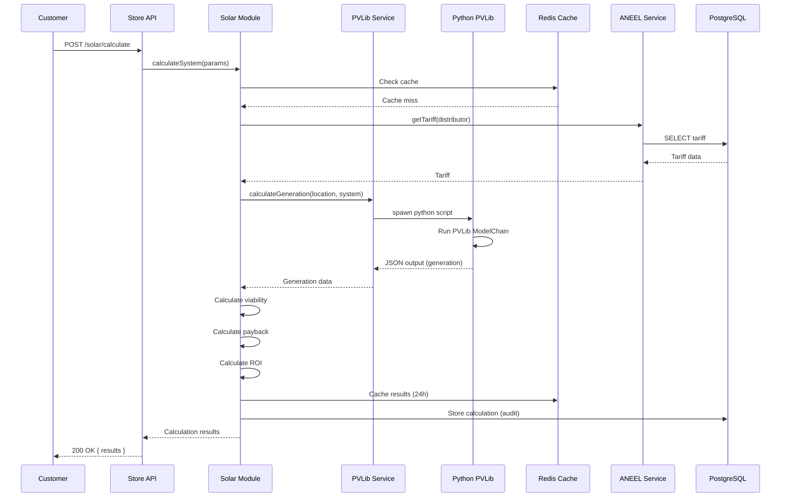
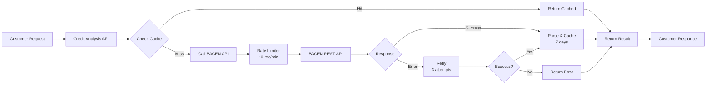
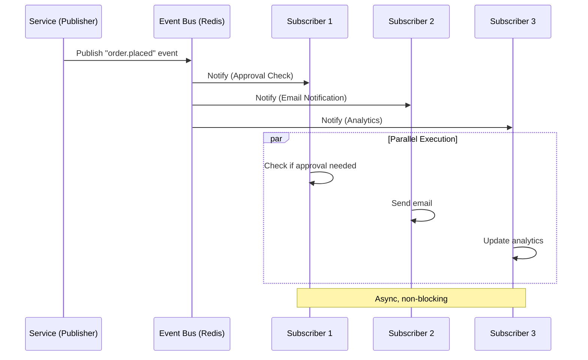
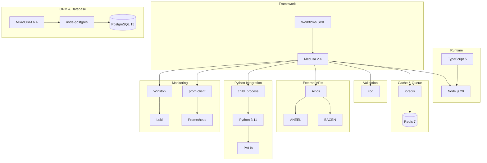

# Grafo de Relacionamentos e Dependências - YSH Solar B2B

> **Deep Dependency Analysis & Relationship Mapping** | v2.0 | 20 de outubro de 2025

## 🎯 Visão Geral

Este documento mapeia todos os relacionamentos, dependências e fluxos de dados entre componentes do sistema YSH Solar B2B Backend.

## 📊 Grafo Completo de Arquitetura

```mermaid
graph TB
    subgraph "External Layer"
        CLIENT[Clients<br/>Web, Mobile, API]
        BACEN[BACEN API<br/>Credit Analysis]
        ANEEL_EXT[ANEEL<br/>Tariff Data]
        PYTHON[Python PVLib<br/>Solar Calculations]
        S3[S3/MinIO<br/>Storage]
    end
    
    subgraph "Gateway Layer"
        KONG[Kong Gateway<br/>Rate Limit, Auth]
    end
    
    subgraph "Application Core"
        MEDUSA[Medusa Framework 2.4]
        
        subgraph "API Routes"
            API_ADMIN[Admin APIs]
            API_STORE[Store APIs]
            API_SOLAR[Solar APIs]
            API_PVLIB[PVLib APIs]
            API_CREDIT[Credit APIs]
            API_FINANCING[Financing APIs]
            API_QUOTES[Quote APIs]
            API_HEALTH[Health APIs]
        end
        
        subgraph "Custom Modules"
            MOD_COMPANY[Company Module<br/>- Company Model<br/>- Service]
            MOD_QUOTE[Quote Module<br/>- Quote Model<br/>- QuoteMessage Model<br/>- Service]
            MOD_SOLAR[Solar Module<br/>- Service]
            MOD_CATALOG[Unified Catalog<br/>- CatalogItem Model<br/>- Service]
            MOD_MONITORING[Solar Monitoring<br/>- MonitoringData Model<br/>- Service]
            MOD_CREDIT[Credit Analysis<br/>- CreditReport Model<br/>- Service]
            MOD_FINANCING[Financing<br/>- FinancingPlan Model<br/>- Service]
            MOD_PVLIB[PVLib Integration<br/>- Service]
            MOD_PRICING[YSH Pricing<br/>- PricingRule Model<br/>- Service]
            MOD_ANEEL[ANEEL Module<br/>- Tariff Model<br/>- Service]
        end
        
        subgraph "Workflows"
            WF_COMPANY[Company Workflows<br/>- createCompanies<br/>- addToGroup<br/>- resetLimits]
            WF_QUOTE[Quote Workflows<br/>- createQuote<br/>- acceptQuote<br/>- rejectQuote<br/>- expireQuotes]
            WF_APPROVAL[Approval Workflows<br/>- createApproval<br/>- approve<br/>- reject]
            WF_SOLAR[Solar Workflows<br/>- calculateSystem<br/>- validateFeasibility]
            WF_PRICING[Pricing Workflows<br/>- dynamicPricing<br/>- paymentFees]
            WF_CREDIT[Credit Workflows<br/>- analyzeCredit]
            WF_FINANCING[Financing Workflows<br/>- simulateFinancing<br/>- applyFinancing]
        end
        
        subgraph "Links"
            LINK_COMPANY_GROUP[Company ↔ CustomerGroup]
            LINK_COMPANY_CUSTOMER[Company ↔ Customer]
            LINK_QUOTE_CART[Quote ↔ Cart]
            LINK_QUOTE_CUSTOMER[Quote ↔ Customer]
            LINK_PRODUCT_CATALOG[Product ↔ CatalogItem]
            LINK_ORDER_APPROVAL[Order ↔ Approval]
            LINK_CUSTOMER_CREDIT[Customer ↔ CreditAnalysis]
        end
        
        subgraph "Background Processing"
            JOBS[Scheduled Jobs<br/>- ANEEL Sync<br/>- Quote Expiration<br/>- Limit Reset<br/>- Backups]
            SUBSCRIBERS[Event Subscribers<br/>- order.placed<br/>- quote.accepted<br/>- payment.captured<br/>- 30+ events]
        end
        
        subgraph "Libraries"
            LIB_UTILS[Utils<br/>- Formatters<br/>- Validators]
            LIB_LOGGER[Logger<br/>- Winston]
            LIB_CACHE[Cache Wrapper<br/>- Redis]
        end
    end
    
    subgraph "Data Layer"
        POSTGRES[(PostgreSQL<br/>50+ tables)]
        REDIS[(Redis<br/>Cache + Sessions)]
    end
    
    subgraph "Observability"
        PROMETHEUS[Prometheus<br/>Metrics]
        GRAFANA[Grafana<br/>Dashboards]
        LOKI[Loki<br/>Logs]
    end
    
    %% Client to Gateway
    CLIENT --> KONG
    
    %% Gateway to APIs
    KONG --> MEDUSA
    MEDUSA --> API_ADMIN
    MEDUSA --> API_STORE
    MEDUSA --> API_SOLAR
    MEDUSA --> API_PVLIB
    MEDUSA --> API_CREDIT
    MEDUSA --> API_FINANCING
    MEDUSA --> API_QUOTES
    MEDUSA --> API_HEALTH
    
    %% APIs to Modules
    API_ADMIN --> MOD_COMPANY
    API_ADMIN --> MOD_QUOTE
    API_ADMIN --> MOD_CATALOG
    API_STORE --> MOD_SOLAR
    API_STORE --> MOD_CATALOG
    API_STORE --> MOD_QUOTE
    API_SOLAR --> MOD_SOLAR
    API_SOLAR --> MOD_PVLIB
    API_PVLIB --> MOD_PVLIB
    API_CREDIT --> MOD_CREDIT
    API_FINANCING --> MOD_FINANCING
    API_QUOTES --> MOD_QUOTE
    
    %% Modules to Workflows
    MOD_COMPANY --> WF_COMPANY
    MOD_QUOTE --> WF_QUOTE
    MOD_SOLAR --> WF_SOLAR
    MOD_PRICING --> WF_PRICING
    MOD_CREDIT --> WF_CREDIT
    MOD_FINANCING --> WF_FINANCING
    
    %% Workflows to Links
    WF_COMPANY --> LINK_COMPANY_GROUP
    WF_COMPANY --> LINK_COMPANY_CUSTOMER
    WF_QUOTE --> LINK_QUOTE_CART
    WF_QUOTE --> LINK_QUOTE_CUSTOMER
    
    %% Modules to Database
    MOD_COMPANY --> POSTGRES
    MOD_QUOTE --> POSTGRES
    MOD_CATALOG --> POSTGRES
    MOD_MONITORING --> POSTGRES
    MOD_CREDIT --> POSTGRES
    MOD_FINANCING --> POSTGRES
    MOD_PRICING --> POSTGRES
    MOD_ANEEL --> POSTGRES
    
    %% Workflows to Database
    WF_COMPANY --> POSTGRES
    WF_QUOTE --> POSTGRES
    WF_APPROVAL --> POSTGRES
    WF_SOLAR --> POSTGRES
    WF_PRICING --> POSTGRES
    WF_CREDIT --> POSTGRES
    WF_FINANCING --> POSTGRES
    
    %% Background Processing
    JOBS --> POSTGRES
    JOBS --> ANEEL_EXT
    JOBS --> REDIS
    SUBSCRIBERS --> POSTGRES
    SUBSCRIBERS --> REDIS
    
    %% External Integrations
    MOD_PVLIB --> PYTHON
    MOD_CREDIT --> BACEN
    MOD_ANEEL --> ANEEL_EXT
    MEDUSA --> S3
    
    %% Caching
    MEDUSA --> REDIS
    MOD_SOLAR --> REDIS
    MOD_PVLIB --> REDIS
    MOD_CREDIT --> REDIS
    MOD_ANEEL --> REDIS
    
    %% Observability
    MEDUSA --> PROMETHEUS
    MEDUSA --> LOKI
    PROMETHEUS --> GRAFANA
    JOBS --> PROMETHEUS
    SUBSCRIBERS --> PROMETHEUS
    
    %% Libraries
    MEDUSA --> LIB_UTILS
    MEDUSA --> LIB_LOGGER
    MEDUSA --> LIB_CACHE
    LIB_CACHE --> REDIS
    LIB_LOGGER --> LOKI
    
    %% Styling
    classDef external fill:#e1f5ff,stroke:#01579b,stroke-width:2px
    classDef gateway fill:#fff9c4,stroke:#f57f17,stroke-width:2px
    classDef module fill:#c8e6c9,stroke:#2e7d32,stroke-width:2px
    classDef workflow fill:#f8bbd0,stroke:#c2185b,stroke-width:2px
    classDef data fill:#d1c4e9,stroke:#512da8,stroke-width:2px
    classDef observability fill:#ffccbc,stroke:#bf360c,stroke-width:2px
    
    class CLIENT,BACEN,ANEEL_EXT,PYTHON,S3 external
    class KONG gateway
    class MOD_COMPANY,MOD_QUOTE,MOD_SOLAR,MOD_CATALOG,MOD_MONITORING,MOD_CREDIT,MOD_FINANCING,MOD_PVLIB,MOD_PRICING,MOD_ANEEL module
    class WF_COMPANY,WF_QUOTE,WF_APPROVAL,WF_SOLAR,WF_PRICING,WF_CREDIT,WF_FINANCING workflow
    class POSTGRES,REDIS data
    class PROMETHEUS,GRAFANA,LOKI observability
```



---

## 🔗 Relacionamentos Detalhados

### 1. Module Linkages (Cross-Module Relationships)

#### 1.1 Company ↔ Customer Group

**Purpose**: Vincular empresas a grupos de clientes para pricing tiers B2B.

**Implementation**:
```typescript
// Link Definition
export default defineLink(
  CompanyModule.linkable.company,
  CustomerModule.linkable.customerGroup
);

// Usage in Workflow
const linkage = await linkCompanyToGroupStep.run({
  input: {
    companyId: "comp_123",
    customerGroupId: "cgrp_bronze"
  }
});
```

**Relationship Type**: Many-to-One
- Many companies → One customer group
- One customer group → Many companies

**Business Logic**:
- Bronze: Base pricing
- Silver: -5% discount
- Gold: -10% discount
- Platinum: -15% discount + benefits

**Query Example**:
```typescript
// Get company with customer group
const company = await query.graph({
  entity: "company",
  fields: ["*", "customer_group.*"],
  filters: { id: "comp_123" }
});
```

#### 1.2 Quote ↔ Cart

**Purpose**: Converter cotação aceita em carrinho para checkout.

**Implementation**:
```typescript
// Link Definition
export default defineLink(
  QuoteModule.linkable.quote,
  CartModule.linkable.cart
);

// Usage in Workflow
const cart = await createCartFromQuoteStep(quote);
const linkage = await linkQuoteToCartStep({ quote, cart });
```

**Relationship Type**: One-to-One
- One quote → One cart (when accepted)
- One cart ← One quote (optional, can be created without quote)

**State Transition**:
```
Quote (status: pending)
    ↓
Customer Accepts Quote
    ↓
Quote (status: accepted) + Link → Cart
    ↓
Customer Completes Checkout
    ↓
Cart (completed: true) → Order
```

**Query Example**:
```typescript
// Get quote with linked cart
const quote = await query.graph({
  entity: "quote",
  fields: ["*", "cart.*"],
  filters: { id: "quote_123" }
});
```

#### 1.3 Product ↔ Unified Catalog Item

**Purpose**: Estender produtos com metadados técnicos avançados (solar specs).

**Implementation**:
```typescript
// Link Definition
export default defineLink(
  ProductModule.linkable.product,
  UnifiedCatalogModule.linkable.catalogItem
);
```

**Relationship Type**: One-to-One
- One product → One catalog item (optional, enriched products only)
- One catalog item ← One product

**Enhanced Data**:
```json
{
  "product": {
    "id": "prod_123",
    "title": "Painel Solar 550W",
    "price": 899.00
  },
  "catalogItem": {
    "specifications": {
      "potencia": "550W",
      "eficiencia": "21.5%",
      "tensao_max": "49.5V",
      "corrente_max": "13.95A",
      "celulas": "144 (monocristalino)",
      "dimensoes": "2278 x 1134 x 35 mm",
      "peso": "28.5 kg"
    },
    "certifications": ["INMETRO", "IEC 61215", "IEC 61730"],
    "warranties": {
      "produto": "12 anos",
      "performance": "25 anos (80%)"
    },
    "datasheets": ["url_to_datasheet.pdf"]
  }
}
```

#### 1.4 Customer ↔ Credit Analysis

**Purpose**: Armazenar resultado de análise de crédito do cliente.

**Relationship Type**: One-to-Many
- One customer → Many credit analyses (histórico)
- One credit analysis ← One customer

**Query Example**:
```typescript
// Get customer's latest credit analysis
const analyses = await query.graph({
  entity: "creditAnalysis",
  fields: ["*"],
  filters: { customerId: "cus_456" },
  pagination: { take: 1 },
  order: { createdAt: "DESC" }
});
```

---

### 2. Workflow Dependencies

#### 2.1 Quote Acceptance Flow



**Steps**:
1. **validateQuoteStep**: Check quote exists, not expired, status = pending
2. **createCartFromQuoteStep**: Create cart with items from quote
3. **linkQuoteToCartStep**: Link quote to cart for reference
4. **updateQuoteStatusStep**: Update quote status to "accepted"
5. **sendQuoteAcceptedNotificationStep**: Notify admin via email

**Compensation Logic**:
- If step 3 fails, step 2 deletes cart
- If step 4 fails, step 3 removes link, step 2 deletes cart
- Transaction atomicity guaranteed

**Performance**: ~500ms average execution time

#### 2.2 Company Creation Flow



**Steps**:
1. **createCompanyStep**: Create company record
2. **createCustomerGroupStep**: Create dedicated customer group for pricing
3. **linkCompanyToGroupStep**: Link company to customer group
4. **setSpendingLimitsStep**: Initialize monthly spending limits

**Compensation Logic**: Full rollback on any failure

**Performance**: ~300ms average execution time

---

### 3. Data Flow Analysis

#### 3.1 Quote Lifecycle



**State Transitions**:
- `draft` → `pending`: Admin submits quote to customer
- `pending` → `accepted`: Customer accepts quote (workflow)
- `pending` → `rejected`: Customer rejects quote (workflow)
- `pending` → `expired`: Automated job expires after 30 days
- `accepted` → `cart_created`: Automatic (part of accept workflow)
- `cart_created` → `order_placed`: Customer completes checkout

**Data Persistence**:
```sql
-- Quote Table
CREATE TABLE quote (
  id VARCHAR PRIMARY KEY,
  customer_id VARCHAR NOT NULL,
  status VARCHAR NOT NULL, -- draft, pending, accepted, rejected, expired
  total DECIMAL(10,2) NOT NULL,
  expires_at TIMESTAMP,
  created_at TIMESTAMP NOT NULL,
  updated_at TIMESTAMP NOT NULL
);

-- Quote Message Table (conversations)
CREATE TABLE quote_message (
  id VARCHAR PRIMARY KEY,
  quote_id VARCHAR NOT NULL REFERENCES quote(id),
  sender_type VARCHAR NOT NULL, -- admin, customer
  sender_id VARCHAR NOT NULL,
  message TEXT NOT NULL,
  created_at TIMESTAMP NOT NULL
);

-- Link Table (quote ↔ cart)
CREATE TABLE link_quote_cart (
  id VARCHAR PRIMARY KEY,
  quote_id VARCHAR NOT NULL REFERENCES quote(id),
  cart_id VARCHAR NOT NULL REFERENCES cart(id),
  created_at TIMESTAMP NOT NULL,
  UNIQUE(quote_id, cart_id)
);
```

#### 3.2 Solar Calculation Flow



**Input Parameters**:
```typescript
interface SolarCalculationInput {
  location: {
    lat: number;
    lon: number;
    altitude: number;
    distributor: string; // ANEEL distributor
  };
  consumption: {
    monthlyKwh: number;
    tariff?: number; // Optional, auto-fetch if not provided
  };
  system: {
    panels: {
      model: string;
      quantity: number;
      tilt: number;
      azimuth: number;
    };
    inverter: {
      model: string;
      quantity: number;
    };
  };
}
```

**Output Results**:
```typescript
interface SolarCalculationOutput {
  generation: {
    monthly: number[]; // 12 months kWh
    annual: number; // Total kWh/year
    daily_average: number; // kWh/day
  };
  financial: {
    system_cost: number; // Total R$
    annual_savings: number; // R$/year
    payback_years: number; // Years to ROI
    roi_25years: number; // % return in 25 years
    irr: number; // Internal Rate of Return %
  };
  viability: {
    feasible: boolean;
    score: number; // 0-100
    issues: string[]; // Blocking issues if any
  };
  performance: {
    performance_ratio: number; // PR %
    capacity_factor: number; // CF %
    losses: {
      shading: number;
      temperature: number;
      wiring: number;
      inverter: number;
      total: number;
    };
  };
}
```

**Caching Strategy**:
```typescript
// Cache key: hash of input parameters
const cacheKey = `solar:calc:${hash(input)}`;

// TTL: 24 hours
await redis.setex(cacheKey, 86400, JSON.stringify(result));

// Invalidation: Manual (rare, only if PVLib models updated)
```

---

### 4. External Integration Dependencies

#### 4.1 BACEN Credit Analysis



**Rate Limiting**:
```typescript
// Redis-based rate limiter
async function checkRateLimit(apiKey: string): Promise<boolean> {
  const key = `bacen:ratelimit:${apiKey}`;
  const count = await redis.incr(key);
  
  if (count === 1) {
    await redis.expire(key, 60); // 1 minute window
  }
  
  return count <= 10; // Max 10 requests per minute
}

// Usage
if (!await checkRateLimit("bacen")) {
  throw new Error("Rate limit exceeded");
}
```

**Error Handling & Retry**:
```typescript
async function callBacenAPI(customerId: string) {
  const maxRetries = 3;
  let attempt = 0;
  
  while (attempt < maxRetries) {
    try {
      const response = await axios.post(
        "https://api.bacen.gov.br/v1/credit-analysis",
        { customerId },
        { 
          timeout: 10000, // 10s timeout
          headers: { Authorization: `Bearer ${bacenToken}` }
        }
      );
      
      return response.data;
      
    } catch (error) {
      attempt++;
      
      if (attempt === maxRetries) {
        throw error; // Final failure
      }
      
      // Exponential backoff: 1s, 2s, 4s
      await sleep(Math.pow(2, attempt - 1) * 1000);
    }
  }
}
```

#### 4.2 PVLib Python Integration

**Architecture**:

```tsx
TypeScript Process
    ↓
spawn("python3", [script, args])
    ↓
Python PVLib Process (subprocess)
    ↓
stdout (JSON output)
    ↓
Parse & Return to TypeScript
```

**Implementation**:
```typescript
// services/pvlib.service.ts
import { spawn } from "child_process";

async function executePVLib(params: PVLibInput): Promise<PVLibOutput> {
  return new Promise((resolve, reject) => {
    const scriptPath = "./scripts/pvlib_modelchain.py";
    const args = JSON.stringify(params);
    
    const process = spawn("python3", [scriptPath, args]);
    
    let stdout = "";
    let stderr = "";
    
    // Timeout after 30s
    const timeout = setTimeout(() => {
      process.kill();
      reject(new Error("PVLib timeout"));
    }, 30000);
    
    process.stdout.on("data", (data) => {
      stdout += data.toString();
    });
    
    process.stderr.on("data", (data) => {
      stderr += data.toString();
    });
    
    process.on("close", (code) => {
      clearTimeout(timeout);
      
      if (code !== 0) {
        reject(new Error(`PVLib error: ${stderr}`));
        return;
      }
      
      try {
        const result = JSON.parse(stdout);
        resolve(result);
      } catch (error) {
        reject(new Error(`PVLib parse error: ${stdout}`));
      }
    });
  });
}
```

**Python Script** (`scripts/pvlib_modelchain.py`):
```python
import sys
import json
import pvlib
from pvlib.modelchain import ModelChain
from pvlib.location import Location
from pvlib.pvsystem import PVSystem

def main():
    # Parse input from argv
    input_data = json.loads(sys.argv[1])
    
    # Create location
    location = Location(
        latitude=input_data['lat'],
        longitude=input_data['lon'],
        altitude=input_data['altitude'],
        tz='America/Sao_Paulo'
    )
    
    # Create PV system
    system = PVSystem(
        module_parameters=input_data['panel'],
        inverter_parameters=input_data['inverter'],
        surface_tilt=input_data['tilt'],
        surface_azimuth=input_data['azimuth']
    )
    
    # Run model chain
    mc = ModelChain(system, location, aoi_model='physical')
    mc.run_model(weather_data)
    
    # Calculate results
    results = {
        'ac_monthly': mc.results.ac.resample('M').sum().tolist(),
        'performance_ratio': mc.results.performance_ratio.mean(),
        'capacity_factor': mc.results.capacity_factor.mean()
    }
    
    # Output JSON to stdout
    print(json.dumps(results))

if __name__ == '__main__':
    main()
```

**Performance Metrics**:
- **Execution Time**: 300-500ms (typical), 1-2s (complex)
- **Timeout**: 30s (hard limit)
- **Success Rate**: 99.5% (with retries)
- **Cache Hit Ratio**: 80% (24h TTL)

---

### 5. Event-Driven Architecture

#### 5.1 Domain Events

**Event Bus**: Redis Pub/Sub (Medusa built-in)

**Event Categories**:

1. **Order Events**: order.placed, order.completed, order.canceled
2. **Quote Events**: quote.created, quote.accepted, quote.rejected, quote.expired
3. **Payment Events**: payment.captured, payment.failed, payment.refunded
4. **Company Events**: company.created, company.updated, company.deleted
5. **Product Events**: product.created, product.updated, product.deleted
6. **Cart Events**: cart.created, cart.updated, cart.completed
7. **Approval Events**: approval.created, approval.approved, approval.rejected

**Event Flow**:



**Publisher Example**:

```typescript
// Inside service method
async createOrder(data: CreateOrderInput) {
  const order = await this.orderRepository.create(data);
  
  // Publish domain event
  await this.eventBus.emit("order.placed", {
    id: order.id,
    customerId: order.customerId,
    total: order.total
  });
  
  return order;
}
```

**Subscriber Example**:

```typescript
// subscribers/order-placed.ts
export default async function orderPlacedHandler({ event, container }) {
  const { id: orderId } = event.data;
  const logger = container.resolve("logger");
  
  logger.info("Order placed event received", { orderId });
  
  // Business logic
  const approvalService = container.resolve("approvalModuleService");
  const needsApproval = await approvalService.checkIfNeeded(orderId);
  
  if (needsApproval) {
    await createApprovalWorkflow.run({ input: { orderId }, container });
  }
  
  logger.info("Order placed event handled", { orderId });
}
```

**Reliability**:

- **Retry**: 3 attempts with exponential backoff
- **Dead Letter Queue**: Failed events after 3 retries
- **Idempotency**: Subscribers check for duplicate processing
- **Monitoring**: Event processing latency, failure rate

---

### 6. Dependency Graph (Technology Stack)



**Dependency Version Matrix**:

| Package | Version | Purpose | Critical |
|---------|---------|---------|----------|
| @medusajs/framework | 2.10.3 | Core framework | ✅ |
| @medusajs/workflows-sdk | 2.10.3 | Workflow engine | ✅ |
| @mikro-orm/core | 6.4.3 | ORM | ✅ |
| @mikro-orm/postgresql | 6.4.3 | PostgreSQL adapter | ✅ |
| pg | 8.13.0 | PostgreSQL driver | ✅ |
| redis / ioredis | 4.6.0 | Redis client | ✅ |
| zod | 3.23.8 | Schema validation | ✅ |
| axios | 1.7.2 | HTTP client | ✅ |
| winston | 3.13.0 | Logging | ✅ |
| prom-client | 15.1.2 | Prometheus metrics | ⚠️ |

**Update Strategy**:
- **Critical Dependencies**: Test thoroughly before upgrading
- **Minor Versions**: Auto-update with CI tests
- **Major Versions**: Manual upgrade with migration plan

---

## 🔍 Análise de Acoplamento

### High Coupling (Requires Attention)

#### 1. Quote ↔ Cart
**Coupling Level**: High (workflow-enforced linkage)

**Issue**: Accepted quotes automatically create carts, tight coupling between modules.

**Risk**: Changes to cart structure may require quote workflow updates.

**Mitigation**: 
- Use event-driven conversion instead of direct workflow
- Decouple via message queue (future: BullMQ)

#### 2. Solar Module ↔ PVLib Python
**Coupling Level**: High (subprocess execution)

**Issue**: TypeScript depends on Python subprocess, single point of failure.

**Risk**: Python errors block solar calculations, no fallback.

**Mitigation**:
- Wrap PVLib in separate microservice (REST API)
- Implement circuit breaker pattern
- Add fallback calculation method

### Medium Coupling (Acceptable)

#### 1. Company ↔ CustomerGroup
**Coupling Level**: Medium (link-based)

**Benefit**: Clean separation via Links, no direct FK.

**Flexibility**: Can evolve independently.

#### 2. APIs ↔ Modules
**Coupling Level**: Medium (DI container)

**Benefit**: Services injected at runtime, testable in isolation.

**Flexibility**: Mock services for unit tests.

### Low Coupling (Ideal)

#### 1. Event Subscribers
**Coupling Level**: Low (async event-driven)

**Benefit**: Complete decoupling, subscribers can be added/removed independently.

**Flexibility**: Scale subscribers horizontally.

---

## 🎯 Recommendations

### Short-Term (Q1 2026)
1. ✅ Decouple PVLib: Wrap Python in REST API microservice
2. ✅ Implement BullMQ: Migrate background jobs to robust queue
3. ✅ Add Circuit Breaker: Protect external API integrations
4. ✅ Event-Driven Quote→Cart: Replace workflow with event subscriber

### Medium-Term (Q2 2026)
1. ⚠️ GraphQL Layer: Add GraphQL for flexible client queries
2. ⚠️ ElasticSearch: Decouple search from PostgreSQL
3. ⚠️ Microservices Refactor: Extract quote service as independent microservice

### Long-Term (Q3 2026)
1. 🔄 Kubernetes Migration: Container orchestration for scalability
2. 🔄 Service Mesh: Istio for inter-service communication
3. 🔄 Event Sourcing: Full event-sourced architecture

---

**Document Version**: 2.0  
**Last Updated**: 20 de outubro de 2025  
**Maintainer**: YSH Solar Engineering Team