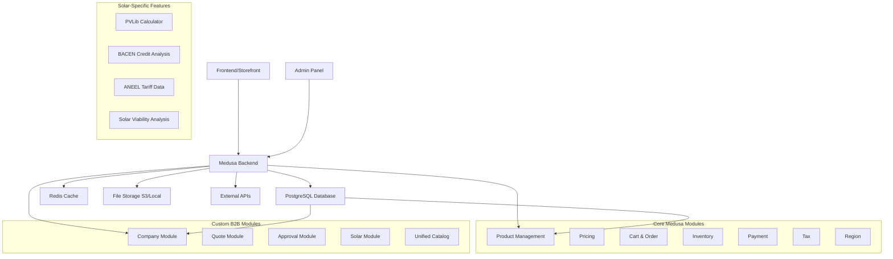

# Blueprint Arquitetural - YSH Solar B2B Backend

## Visão Geral

O backend YSH Solar Hub é uma aplicação Medusa 2.4 customizada para e-commerce B2B de energia solar, com foco em funcionalidades específicas do setor como cálculo de viabilidade, análise de crédito e catálogo especializado de produtos solares.

## Arquitetura de Alto Nível

## Componentes Principais

### 1. Framework Core - Medusa 2.4
- **Propósito**: Framework headless e-commerce com arquitetura modular
- **Tecnologias**: Node.js 20, TypeScript 5, MikroORM
- **Benefícios**: Escalabilidade, customização extensiva, comunidade ativa

### 2. Módulos Core Medusa
- **Product**: Gestão de catálogo de produtos solares
- **Pricing**: Precificação B2B com regras customizadas
- **Cart/Order**: Fluxos de compra com aprovações
- **Inventory**: Controle de estoque de equipamentos
- **Payment**: Integração Stripe para processamento
- **Tax/Region**: Suporte multi-região e tributação

### 3. Módulos B2B Customizados

#### Company Module
- **JTBD**: Gerenciar empresas B2B e suas configurações
- **Funcionalidades**: CRUD empresas, hierarquia colaboradores, limites de gasto
- **Integrações**: Customer Groups, Approval Workflows

#### Quote Module
- **JTBD**: Sistema de Request for Quote (RFQ)
- **Funcionalidades**: Cotações, mensagens, aceite/rejeição
- **Workflows**: createQuotesWorkflow, customerAcceptQuoteWorkflow

#### Approval Module
- **JTBD**: Workflows de aprovação para pedidos
- **Funcionalidades**: Regras configuráveis, bloqueio checkout
- **Hooks**: validate-cart-completion.ts

#### Solar Module
- **JTBD**: Funcionalidades específicas de energia solar
- **Submódulos**: Calculadora PVLib, ANEEL tariffs, Viabilidade
- **APIs**: /solar/calculate, /pvlib/model, /aneel/tariffs

#### Unified Catalog
- **JTBD**: Catálogo unificado de produtos solares
- **Funcionalidades**: SKUs avançados, imagens, metadados
- **Estrutura**: painéis, inversores, estruturas, cabos, etc.

### 4. APIs e Integrações Externas

#### BACEN API
- **Propósito**: Análise de crédito para financiamento
- **Endpoint**: /credit-analysis/
- **Dados**: Score de crédito, histórico financeiro

#### PVLib (Python)
- **Propósito**: Cálculos de geração solar
- **Integração**: Script Python modelchain.py
- **Saídas**: Estimativa kWh/mês, performance

#### ANEEL
- **Propósito**: Dados regulatórios e tarifas
- **Módulo**: aneel/
- **Uso**: Cálculo economia, conformidade

### 5. Infraestrutura e DevOps

#### Database Layer
- **Tecnologia**: PostgreSQL 15
- **ORM**: MikroORM
- **Migrações**: Scripts SQL versionados

#### Cache Layer
- **Tecnologia**: Redis 7
- **Uso**: Sessões, cache de queries

#### File Storage
- **Opções**: S3 (produção) / Local (desenvolvimento)
- **Conteúdo**: Imagens produtos, uploads

#### Containerização
- **Docker**: Multi-stage builds otimizados
- **Compose**: Ambiente desenvolvimento completo
- **Workers**: Processamento assíncrono

#### Monitoramento
- **Stack**: Prometheus + Grafana + Loki
- **Gateway**: Kong API Gateway
- **Logs**: Promtail para coleta

### 6. Pipelines de Dados

#### Dagster
- **Propósito**: ETL e processamento batch
- **Uso**: Importação catálogo, analytics

#### Pathway
- **Propósito**: Processamento streaming
- **Uso**: Dados em tempo real, monitoring solar

### 7. Estratégia de Testes

#### Testes Unitários
- **Framework**: Jest + SWC
- **Cobertura**: Funções, módulos, workflows

#### Testes de Integração
- **HTTP**: Supertest para APIs
- **Módulos**: Testes entre módulos
- **Contratos**: Pact para APIs externas

#### Testes E2E
- **Cobertura**: Fluxos completos (cotações → pedidos)
- **Automação**: Scripts de setup/teardown

### 8. Segurança e Conformidade

#### Autenticação
- **JWT**: Tokens para sessões
- **Cookies**: Secure cookies
- **Roles**: Admin, Company Admin, Employee

#### Autorização
- **RBAC**: Role-Based Access Control
- **Approvals**: Workflows de aprovação
- **Limits**: Gastos por colaborador

#### Dados Sensíveis
- **Secrets**: Gerenciamento seguro
- **Encryption**: Dados em trânsito/reposo
- **Compliance**: LGPD, regulamentações solares

### 9. Estratégia de Deployment

#### Desenvolvimento
- **Local**: Docker Compose
- **Hot Reload**: Medusa develop
- **Debugging**: VS Code + source maps

#### Staging/Produção
- **Cloud**: AWS CloudFormation
- **Containers**: ECR + ECS/Fargate
- **CDN**: CloudFront para assets

#### CI/CD
- **Build**: GitHub Actions
- **Test**: Paralelo unit/integration
- **Deploy**: Blue-green strategy

### 10. Escalabilidade e Performance

#### Otimizações
- **Caching**: Redis para queries frequentes
- **CDN**: Assets estáticos
- **Database**: Índices otimizados, partitioning

#### Monitoramento
- **Métricas**: Response times, throughput
- **Alertas**: Error rates, performance degradation
- **Logs**: Estruturados com contexto

## Roadmap de Evolução

### Fase 1 (Atual)
- Core B2B features implementadas
- Catálogo solar básico
- Integrações essenciais (BACEN, PVLib)

### Fase 2 (Próxima)
- Advanced analytics
- AI-powered recommendations
- Multi-tenant architecture

### Fase 3 (Futuro)
- IoT integration (monitoring solar)
- Blockchain for certificates
- Global expansion

## Conclusão

Esta arquitetura fornece uma base sólida para o crescimento do YSH Solar Hub, combinando a flexibilidade do Medusa com customizações específicas do mercado solar brasileiro. A abordagem modular permite evolução incremental enquanto mantém estabilidade e performance.</content>
<parameter name="filePath">C:/Users/fjuni/OneDrive/Documentos/GitHub/ysh-b2b/backend/blueprint.md