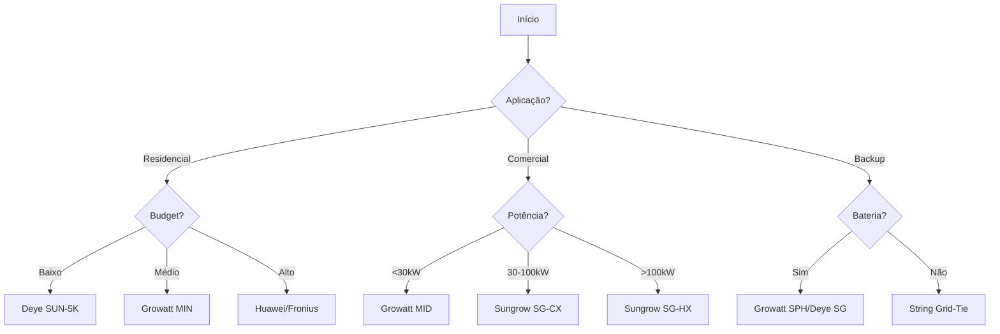

# 📑 INVERSORES SOLARES - ÍNDICE DE NAVEGAÇÃO RÁPIDA

**Documento Mestre:** INVERSORES_CONSOLIDADO_360.md  
**Data:** 19 de Outubro de 2025  
**Versão:** 1.0

---

## 🎯 NAVEGAÇÃO RÁPIDA

### Por Categoria

#### [⚡ Inversores String (Grid-Tie)](#string-grid-tie)

- [Growatt - #1 Brasil](#1-growatt-)
- [Sungrow - #1 Global](#2-sungrow-)
- [Deye - Melhor Custo](#3-deye-)
- [Goodwe - Alta Eficiência](#4-goodwe-)
- [Fronius - Premium Europeu](#5-fronius-)
- [Huawei - Alta Tecnologia](#6-huawei-)

#### [🔌 Microinversores](#microinversores-mlpe)
- [Enphase - Líder Global](#7-enphase-)
- [Hoymiles - Custo-Benefício](#8-hoymiles-)
- [APsystems - Tecnologia Avançada](#9-apsystems-)

#### [🔋 Inversores Híbridos](#inversores-híbridos-grid--battery)
- [Growatt SPH - Melhor Custo](#10-growatt---sph-series-)
- [Deye SG - Alta Performance](#11-deye---sun-xk-sg-hybrid-series-)
- [Goodwe EM/ET - Premium](#12-goodwe---gw5048-em--et-series-)

---

## 🏆 TOP 5 RANKINGS

### Por Eficiência Máxima

| Ranking | Fabricante | Modelo | Eficiência | Categoria |
|---------|------------|--------|------------|-----------|
| 🥇 | **Huawei** | SUN2000-5KTL | 98.65% | String |
| 🥈 | **Sungrow** | SG5.0RS | 98.6% | String |
| 🥉 | **Growatt** | MID 5KTL3-X | 98.4% | String |
| 4º | **Goodwe** | GW5000-DNS | 98.1% | String |
| 5º | **Enphase** | IQ8 Plus | 97.6% | Microinversor |

### Por Custo-Benefício

| Ranking | Fabricante | R$/kW | Eficiência | Score C-B |
|---------|------------|-------|------------|-----------|
| 🥇 | **Growatt** | R$ 540 | 98.4% | ⭐⭐⭐⭐⭐ |
| 🥈 | **Deye** | R$ 480 | 97.6% | ⭐⭐⭐⭐ |
| 🥉 | **Goodwe** | R$ 580 | 98.1% | ⭐⭐⭐⭐⭐ |
| 4º | **Sungrow** | R$ 620 | 98.6% | ⭐⭐⭐⭐⭐ |
| 5º | **Hoymiles** | R$ 1.40/W | 96.7% | ⭐⭐⭐⭐ |

### Por Disponibilidade

| Ranking | Fabricante | Distribuidores | Lead Time | Estoque |
|---------|------------|----------------|-----------|---------|
| 🥇 | **Growatt** | 5/5 | 3-7 dias | 🟢 Alto |
| 🥈 | **Deye** | 4/5 | 3-10 dias | 🟢 Altíssimo |
| 🥉 | **Sungrow** | 3/5 | 5-15 dias | 🟢 Alto |
| 4º | **Goodwe** | 3/5 | 7-20 dias | 🟢 Alto |
| 5º | **Enphase** | 3/5 | 5-15 dias | 🟢 Alto |

### Por Confiabilidade (Taxa de Falha)

| Ranking | Fabricante | Falha Anual | Garantia | PVEL Top Performer |
|---------|------------|-------------|----------|-------------------|
| 🥇 | **Enphase** | 0.05% | 25 anos | ✅ 2020-2024 |
| 🥈 | **Fronius** | 0.3% | 10+15 anos | ✅ 2020-2024 |
| 🥉 | **Huawei** | 0.4% | 10+15 anos | ✅ 2021-2024 |
| 4º | **Sungrow** | 0.5% | 10+20 anos | ✅ 2020-2024 |
| 5º | **Goodwe** | 0.6% | 10+10 anos | ✅ 2022-2024 |

### Por Eficiência Microinversores

| Ranking | Fabricante | Modelo | Eficiência CEC | Garantia |
|---------|------------|--------|----------------|----------|
| 🥇 | **Enphase** | IQ8 Plus | 97.6% | 25 anos |
| 🥈 | **APsystems** | DS3 | 97.3% | 10 anos |
| 🥉 | **Hoymiles** | HMS-800 | 96.7% | 12 anos |

---

## 📊 COMPARATIVOS RÁPIDOS

### String Residencial (3-10kW)

| Critério | Budget | Balanceado | Premium |
|----------|--------|------------|---------|
| **Fabricante** | Deye | Growatt | Huawei |
| **Modelo** | SUN-5K-G03 | MIN 5000TL-XH | SUN2000-5KTL |
| **Eficiência** | 97.6% | 98.4% | 98.65% |
| **Preço** | R$ 2.400 | R$ 2.800 | R$ 3.400 |
| **R$/kW** | R$ 480 | R$ 560 | R$ 680 |
| **Garantia** | 10 anos | 10 anos | 10+15 anos |
| **MPPT** | 2 | 2 | 2 |
| **AFCI** | ❌ | ✅ | ✅ |
| **Monitoramento** | SOLARMAN | ShinePhone | FusionSolar AI |
| **Aplicação** | Residencial básico | Residencial completo | Residencial premium |

### String Comercial (15-100kW)

| Critério | Budget | Balanceado | Premium |
|----------|--------|------------|---------|
| **Fabricante** | Deye | Growatt | Sungrow |
| **Série** | SUN-xK-SG | MID Series | SG-CX |
| **Eficiência** | 98.0% | 98.7% | 98.7% |
| **R$/kW** | R$ 420 | R$ 450 | R$ 480 |
| **MPPT** | 2-4 | 3-4 | 6-9 |
| **Certificações** | INMETRO, IEC | INMETRO, VDE, IEC | INMETRO, VDE, TÜV |
| **Aplicação** | Comércio básico | Indústria leve | Indústria pesada |

### Microinversores

| Critério | Premium | Custo-Benefício | Avançado |
|----------|---------|-----------------|----------|
| **Fabricante** | Enphase | Hoymiles | APsystems |
| **Modelo** | IQ8 Plus | HMS-800 | DS3 |
| **Potência** | 300-400W | 600-800W | 730-880W |
| **Eficiência** | 97.6% | 96.7% | 97.3% |
| **R$/unidade** | R$ 630-960 | R$ 420-680 | R$ 560-840 |
| **Painéis/Unid** | 1-4 | 2 | 2 |
| **Garantia** | 25 anos | 12 anos | 10 anos |
| **Monitoramento** | Enlighten | S-Miles | EMA |
| **Grid-Forming** | ✅ IQ8 | ❌ | ❌ |

### Híbridos (Grid + Battery)

| Critério | Custo-Benefício | Alta Tensão | Premium |
|----------|-----------------|-------------|---------|
| **Fabricante** | Growatt | Deye | Goodwe |
| **Série** | SPH | SUN-SG HP | EM/ET |
| **Potência** | 3-10kW | 5-12kW | 3-10kW |
| **Eficiência** | 97.6% | 97.6% | 97.6% |
| **Sistema (5kW)** | R$ 9.200 | R$ 10.500 | R$ 13.500 |
| **Bateria** | 48V (2.4-28.8kWh) | HV 150-550V | HV 180-550V |
| **Backup UPS** | <10ms | <10ms | <10ms |
| **Time-of-Use** | ✅ | ✅ | ✅ |
| **Paralelização** | Até 6 unid | Até 16 unid | Até 3 unid |

---

## 🔍 BUSCA POR NECESSIDADE

### "Preciso de maior eficiência possível"

→ **Huawei SUN2000** (98.65%) ou **Sungrow SG-RS** (98.6%)

### "Preciso de menor preço"

→ **Deye SUN-xK-G03** (R$ 480/kW)

### "Preciso de melhor custo-benefício"

→ **Growatt MIN Series** (98.4% + R$ 540/kW)

### "Preciso de microinversor confiável"

→ **Enphase IQ8+** (25 anos garantia, 0.05% falha)

### "Preciso de microinversor barato"

→ **Hoymiles HMS-800** (R$ 420-680/unid)

### "Preciso de híbrido com backup"

→ **Growatt SPH** (melhor custo) ou **Goodwe EM** (premium)

### "Preciso de sistema comercial escalável"

→ **Sungrow SG-CX** (até 125kW) ou **Growatt MID** (até 40kW)

### "Preciso de qualidade europeia"

→ **Fronius Primo/Symo** (Áustria, 10+15 anos garantia)

### "Preciso de tecnologia IA"

→ **Huawei SUN2000** (FusionSolar AI)

### "Preciso de pronta entrega"

→ **Growatt** (3-7 dias) ou **Deye** (3-10 dias)

---

## 📖 SEÇÕES DO DOCUMENTO PRINCIPAL

### Estrutura Completa

1. **Resumo Executivo** (Linhas 1-40)
   - Estatísticas gerais
   - Distribuição por categoria

2. **Inversores String** (Linhas 41-570)
   - Growatt (MIN/MID/MAX/MOD)
   - Sungrow (SG-RS/CX/HX)
   - Deye (SUN-xK-G)
   - Goodwe (GW-XS/DNS/MT)
   - Fronius (Primo/Symo/Eco)
   - Huawei (SUN2000)

3. **Microinversores** (Linhas 571-710)
   - Enphase (IQ7/IQ8)
   - Hoymiles (HM/HMS)
   - APsystems (DS3/QS1/YC600)

4. **Inversores Híbridos** (Linhas 711-930)
   - Growatt SPH
   - Deye SUN-SG
   - Goodwe EM/ET

5. **Comparativos** (Linhas 931-980)
   - Performance
   - TCO 25 anos
   - Matriz de seleção

6. **Requisitos Técnicos** (Linhas 981-1050)
   - Certificações
   - Proteções
   - Garantias

7. **Logística** (Linhas 1051-1080)
   - Disponibilidade
   - Distribuidores
   - Lead times

8. **Glossário** (Linhas 1081-1150)
   - Termos técnicos
   - Definições

9. **Recomendações Finais** (Linhas 1151-1180)
   - Top 3 por categoria

10. **Suporte** (Linhas 1181-1220)
    - Contatos fabricantes

---

## 🎯 FLUXO DE DECISÃO

### Para Vendedor/Projetista

### Para Cliente Final

**Passo 1:** Determinar potência necessária (kWp)  
**Passo 2:** Definir budget (baixo/médio/alto)  
**Passo 3:** Avaliar necessidade backup  
**Passo 4:** Escolher entre String/Micro  
**Passo 5:** Selecionar fabricante baseado em matriz

---

## 📞 LINKS ÚTEIS

### Documentos Relacionados

- [PAINEIS_SOLARES_CONSOLIDADO_360.md](PAINEIS_SOLARES_CONSOLIDADO_360.md)
- [INVERSORES_QUICK_REFERENCE.md](INVERSORES_QUICK_REFERENCE.md)
- [INVERSORES_README.md](INVERSORES_README.md)

### Ferramentas

- [Calculadora de Dimensionamento YSH](#)
- [Comparador de Inversores](#)
- [Verificador de Compatibilidade MPPT](#)

### Recursos Externos

- [INMETRO - Portaria 357/2014](http://www.inmetro.gov.br/)
- [IEC Standards](https://www.iec.ch/)
- [PVEL PV Module/Inverter Reliability Scorecard](https://www.pvel.com/)

---

**Última atualização:** 19 de Outubro de 2025  
**Versão:** 1.0  
**Próxima revisão:** Trimestral

© 2025 Yellow Solar Hub - YSH Solar B2B Platform
