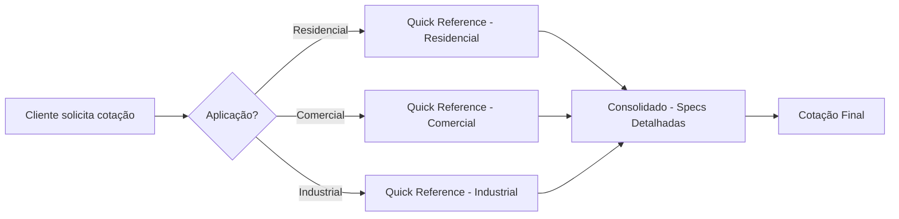

# 🌞 PAINÉIS SOLARES - DOCUMENTAÇÃO CONSOLIDADA YSH

> **Cobertura 360º do Inventário de Painéis Fotovoltaicos**

---

## 📚 DOCUMENTOS DISPONÍVEIS

### 1. 📖 Consolidado Completo (Principal)

**[`PAINEIS_SOLARES_CONSOLIDADO_360.md`](./PAINEIS_SOLARES_CONSOLIDADO_360.md)**

Documento técnico completo com análise detalhada de:

- ✅ 14 fabricantes principais (Tier 1, 2 e 3)
- ✅ 5 tecnologias (PERC, N-Type, Bifacial, HJT, Poly)
- ✅ 4.500+ SKUs catalogados
- ✅ Especificações técnicas detalhadas
- ✅ Análise de pricing e ROI
- ✅ Certificações e normas
- ✅ Logística e disponibilidade

**Ideal para:** Especificação técnica, análise de mercado, treinamento de equipe

---

### 2. 📑 Índice de Navegação

**[`PAINEIS_SOLARES_INDEX.md`](./PAINEIS_SOLARES_INDEX.md)**

Índice organizado para navegação rápida:
- 🔍 Busca por fabricante
- 🔍 Busca por tecnologia
- 🔍 Busca por aplicação
- 🔍 Comparativos rápidos
- 🔍 Links para seções específicas

**Ideal para:** Navegação rápida, consultas específicas

---

### 3. ⚡ Quick Reference Card

**[`PAINEIS_QUICK_REFERENCE.md`](./PAINEIS_QUICK_REFERENCE.md)**

Guia de consulta rápida para vendas:
- 🎯 Seleção por aplicação
- 🏆 Top 5 por critério
- 💰 Tabelas de preços
- 📊 Specs técnicas resumidas
- 🔢 Cálculos rápidos
- 🎓 Argumentos de venda

**Ideal para:** Equipe de vendas, atendimento ao cliente, cotações rápidas

---

## 🎯 COMO USAR ESTA DOCUMENTAÇÃO

### Para Vendas/Atendimento



**Fluxo Recomendado:**
1. **Quick Reference** → Seleção inicial (aplicação + budget)
2. **Consolidado 360º** → Especificações técnicas detalhadas
3. **Index** → Comparação entre alternativas

---

### Para Especificação Técnica


**Fluxo Recomendado:**
1. **Consolidado - Matriz Tecnologias** → Escolher tecnologia (PERC/N-Type/Bifacial)
2. **Consolidado - Fabricantes** → Selecionar marca e série
3. **Quick Reference - Cálculos** → Dimensionamento e estimativas

---

### Para Procurement/Compras

**Fluxo Recomendado:**
1. **Consolidado - Análise de Pricing** → Benchmarking de preços
2. **Consolidado - Disponibilidade** → Prazos e logística
3. **Index - Gaps de Inventário** → Oportunidades de expansão

---

## 📊 ESTRUTURA DO INVENTÁRIO

### Distribuição por Tier

```
┌─────────────────────────────────────────┐
│  TIER 1 (Top Global)                    │
│  3.050 SKUs (67.8%)                     │
│  Canadian, JA Solar, Jinko, Trina, LONGi│
├─────────────────────────────────────────┤
│  TIER 2 (Alta Qualidade)                │
│  1.177 SKUs (26.2%)                     │
│  Astronergy, DAH, Risen, Sunova         │
├─────────────────────────────────────────┤
│  TIER 3 (Entry-Level)                   │
│  273 SKUs (6.0%)                        │
│  Ztroon, Znshine, OSDA                  │
└─────────────────────────────────────────┘
```

### Distribuição por Tecnologia

| Tecnologia | SKUs | % | Preço/Wp | Status |
|------------|------|---|----------|--------|
| **PERC** | 2.800 | 62.2% | R$ 0.75-0.95 | ✅ Madura |
| **N-Type** | 850 | 18.9% | R$ 0.90-1.15 | 🚀 Crescimento |
| **Bifacial** | 620 | 13.8% | R$ 0.85-1.10 | 📈 Expansão |
| **HJT** | 180 | 4.0% | R$ 1.15-1.45 | 💎 Nicho |
| **Poly** | 50 | 1.1% | R$ 0.48-0.65 | 🔴 Descontinuado |

---

## 🎯 QUICK LINKS

### Por Fabricante (Tier 1)

- **[Canadian Solar](./PAINEIS_SOLARES_CONSOLIDADO_360.md#1-canadian-solar-)** → 800+ SKUs | PERC, N-Type, Bifacial
- **[JA Solar](./PAINEIS_SOLARES_CONSOLIDADO_360.md#2-ja-solar-)** → 650+ SKUs | PERC Bifacial, Deep Blue
- **[Jinko Solar](./PAINEIS_SOLARES_CONSOLIDADO_360.md#3-jinko-solar-)** ⭐ → 720+ SKUs | Tiger Neo N-Type
- **[Trina Solar](./PAINEIS_SOLARES_CONSOLIDADO_360.md#4-trina-solar-)** → 580+ SKUs | Vertex, Vertex S+
- **[LONGi Solar](./PAINEIS_SOLARES_CONSOLIDADO_360.md#5-longi-solar-)** → 450+ SKUs | Hi-MO 5/6

### Por Tecnologia

- **[PERC](./PAINEIS_SOLARES_CONSOLIDADO_360.md#1-monocristalino-perc-passivated-emitter-rear-cell)** → 62.2% | Padrão mercado
- **[N-Type TOPCon](./PAINEIS_SOLARES_CONSOLIDADO_360.md#2-n-type-topcon-tunnel-oxide-passivated-contact)** → 18.9% | Premium
- **[Bifacial](./PAINEIS_SOLARES_CONSOLIDADO_360.md#3-bifacial-dupla-face)** → 13.8% | +10-30% geração
- **[HJT](./PAINEIS_SOLARES_CONSOLIDADO_360.md#4-hjt-heterojunction-technology)** → 4.0% | Ultra-premium

### Por Aplicação

- **[Residencial](./PAINEIS_QUICK_REFERENCE.md#residencial--10-kwp)** → Budget, Custo-Benefício, Premium
- **[Comercial](./PAINEIS_QUICK_REFERENCE.md#comercial-10-50-kwp)** → Standard, N-Type, Bifacial
- **[Industrial](./PAINEIS_QUICK_REFERENCE.md#industrialutility-50-kwp)** → High-Power, Utility Scale

---

## 🔍 CONSULTAS RÁPIDAS

### Top Produtos por Critério

**Melhor Custo-Benefício:**
→ [Risen Titan 550W](./PAINEIS_QUICK_REFERENCE.md#melhor-custo-benefício) - R$ 0.80/Wp

**Maior Eficiência:**
→ [Jinko Tiger Neo 640W](./PAINEIS_QUICK_REFERENCE.md#maior-eficiência) - 23.2%

**Melhor LCOE:**
→ [Jinko Tiger Neo 640W](./PAINEIS_QUICK_REFERENCE.md#melhor-lcoe-rkwh) - R$ 0.20/kWh

**Maior Garantia:**
→ [Jinko Tiger Neo](./PAINEIS_QUICK_REFERENCE.md#maior-garantia) - 30 anos (87.4% @ 30a)

### Faixas de Preço

| Segmento | Preço/Wp |
|----------|----------|
| Budget | R$ 0.52-0.75 |
| Standard | R$ 0.75-0.95 |
| Premium | R$ 0.95-1.15 |
| Ultra-Premium | R$ 1.15-1.45 |

### Calculadora Rápida

**Geração Mensal:**
```
kWh/mês = kWp × HSP × 30 × 0.80
```

**Payback:**
```
Anos = Investimento / (Geração Anual × Tarifa)
```

**Área Necessária:**
```
m² = (kWp / Eficiência %) × 6
```

---

## 📈 INSIGHTS ESTRATÉGICOS

### Tendências 2025-2026

**1. Transição N-Type TOPCon**
- Atual: 18.9% → Previsão 2026: 35-40%
- Preços convergindo com PERC
- **Ação:** Expandir estoque N-Type em 60%

**2. Descontinuação Policristalino**
- Status: 1.1% (fase out)
- **Ação:** Zerar estoque até Q1 2026

**3. Crescimento Bifacial**
- Crescimento: +28% a/a
- **Ação:** Expandir linha em 40%

### Gaps de Inventário

**Oportunidades:**
- ❌ REC Solar (HJT) - 30 SKUs
- ❌ SunPower (IBC) - 20 SKUs
- ❌ All-Black premium - 100 SKUs
- ❌ Painéis 700W+ - 80 SKUs
- ❌ Glass-glass - 120 SKUs

---

## 🎓 RECURSOS DE TREINAMENTO

### Argumentos de Venda

**[PERC vs N-Type](./PAINEIS_QUICK_REFERENCE.md#perc-vs-n-type)**
- Quando recomendar cada tecnologia
- Diferenças de ROI e payback
- Perfil de cliente ideal

**[Bifacial vs Monofacial](./PAINEIS_QUICK_REFERENCE.md#bifacial-vs-monofacial)**
- Cálculo de ganho bifacial
- Condições ideais de aplicação
- Casos de uso recomendados

### Especificações Técnicas

**[Coeficiente de Temperatura](./PAINEIS_QUICK_REFERENCE.md#coeficiente-de-temperatura-pmax)**
- Performance em alta temperatura
- Comparativo por tecnologia

**[Degradação](./PAINEIS_QUICK_REFERENCE.md#degradação-anual)**
- Degradação ano 1 vs linear
- Performance ao longo da vida útil

**[Bifacialidade](./PAINEIS_QUICK_REFERENCE.md#bifacialidade)**
- Percentual de ganho por modelo
- Fatores que influenciam geração traseira

---

## 📞 CONTATOS E SUPORTE

### Distribuidores

| Distribuidor | Cobertura | Contato |
|--------------|-----------|---------|
| **NeoSolar** | Nacional | [Portal B2B](https://portalb2b.neosolar.com) |
| **FortLev** | Nacional | [FortLev Solar](https://fortlevsolar.app) |
| **FOTUS** | Sudeste/Sul | [FOTUS Portal](https://fotus.com.br) |
| **ODEX** | Nacional | [ODEX B2B](https://odex.com.br) |
| **Solfacil** | Nacional | [Solfacil](https://solfacil.com.br) |

### Suporte Técnico YSH

**Email:** technical@ysh.com.br  
**WhatsApp:** +55 11 XXXX-XXXX  
**Horário:** Segunda a Sexta, 8h-18h

---

## 🔄 ATUALIZAÇÕES E MANUTENÇÃO

### Última Atualização
**Data:** 19 de Outubro de 2025  
**Versão:** 1.0.0

### Changelog

**v1.0.0 (19/10/2025):**
- ✅ Documentação completa 360º
- ✅ 4.500+ SKUs catalogados
- ✅ 14 fabricantes principais
- ✅ 5 tecnologias mapeadas
- ✅ Quick Reference Card
- ✅ Índice de navegação

### Próximas Atualizações

**Q4 2025:**
- [ ] Adicionar calculadora interativa
- [ ] Integrar API de pricing real-time
- [ ] Dashboard visual de comparação

**Q1 2026:**
- [ ] Expandir para 5.000+ SKUs
- [ ] Adicionar REC Solar e SunPower
- [ ] Sistema de recomendação IA

---

## 📄 LICENÇA E USO

### Uso Interno YSH

Esta documentação é de uso exclusivo da **YSH Solar B2B Platform** e equipe autorizada.

**Permitido:**
- ✅ Consulta para especificação técnica
- ✅ Uso em cotações e propostas comerciais
- ✅ Treinamento interno de equipe
- ✅ Base de conhecimento para atendimento

**Não Permitido:**
- ❌ Distribuição externa sem autorização
- ❌ Uso por concorrentes
- ❌ Reprodução parcial ou total sem créditos

---

## 🙏 CRÉDITOS

**Desenvolvido por:** YSH Solar Analytics Team  
**Contribuidores:**
- Equipe de Procurement
- Equipe Técnica
- Equipe Comercial
- Data Engineering

**Fontes de Dados:**
- Distribuidores parceiros (NeoSolar, FortLev, FOTUS, ODEX, Solfacil)
- Datasheets fabricantes
- Certificações INMETRO
- Bloomberg New Energy Finance
- PVEL PV Module Scorecard

---

## 📧 FEEDBACK

Encontrou algum erro ou tem sugestão de melhoria?

**Envie para:** analytics@ysh.com.br  
**Assunto:** [PAINÉIS] Feedback Documentação

Ou abra uma issue no repositório interno.

---

<div align="center">

**🌞 YSH Solar B2B Platform**

*Energia Solar Inteligente para o Brasil*

[Website](https://ysh.com.br) | [Portal B2B](#) | [Suporte](#)

</div>
