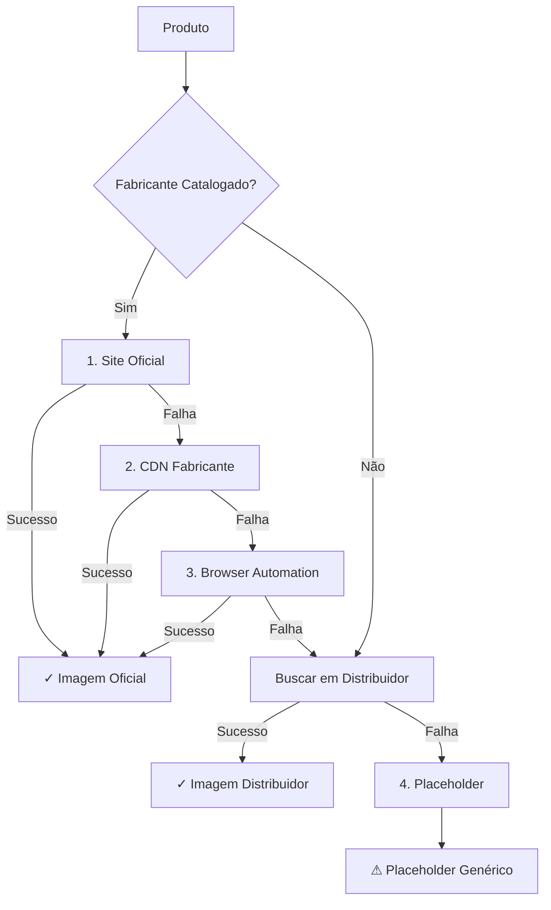

# Relatório 360° - Imagens do Catálogo de Produtos

**Gerado em:** 21/10/2025, 10:50:07

---

## 📊 Sumário Executivo

| Métrica | Valor |
|---------|-------|
| **Total de Produtos** | 2 |
| **Com Imagens** | 0 (0%) |
| **Sem Imagens** | 2 (100%) |
| **Nomenclatura Padronizada** | 0% |

## 🎯 Fontes de Imagens

| Fonte | Quantidade | Percentual |
|-------|------------|------------|
| ❓ none | 2 | 100% |

## 🏭 Fabricantes Catalogados

**Total de Fabricantes:** 16

| Fabricante | Total | Oficial | Distribuidor | Placeholder | Cobertura |
|------------|-------|---------|--------------|-------------|-----------|
| LONGi Solar | 0 | 0 | 0 | 0 | 🔴 0% |
| Growatt | 0 | 0 | 0 | 0 | 🔴 0% |
| Sungrow | 0 | 0 | 0 | 0 | 🔴 0% |
| Risen Energy | 0 | 0 | 0 | 0 | 🔴 0% |
| JinkoSolar | 0 | 0 | 0 | 0 | 🔴 0% |
| Trina Solar | 0 | 0 | 0 | 0 | 🔴 0% |
| Canadian Solar | 0 | 0 | 0 | 0 | 🔴 0% |
| BYD | 0 | 0 | 0 | 0 | 🔴 0% |
| Fronius | 0 | 0 | 0 | 0 | 🔴 0% |
| Deye | 0 | 0 | 0 | 0 | 🔴 0% |
| Solis | 0 | 0 | 0 | 0 | 🔴 0% |
| Huawei | 0 | 0 | 0 | 0 | 🔴 0% |
| Pylontech | 0 | 0 | 0 | 0 | 🔴 0% |
| Dyness | 0 | 0 | 0 | 0 | 🔴 0% |
| Enphase Energy | 0 | 0 | 0 | 0 | 🔴 0% |
| Fortlev Solar | 0 | 0 | 0 | 0 | 🔴 0% |

## 📦 Produtos por Categoria

| Categoria | Quantidade | Percentual |
|-----------|------------|------------|
| 🔧 other | 2 | 100% |

## 📝 Padrão de Nomenclatura

**Padrão Adotado:** `{FABRICANTE}-{MODELO}-{POTENCIA}.{ext}`

**Exemplos de Nomenclatura Correta:**
```
LONGI-LR5-72HPH-585M.png
GROWATT-MIN-3000TL-X.jpg
SUNGROW-SG3.0RS.jpg
BYD-HVM-13.8.png
```

**Taxa de Conformidade Atual:** 0%

## 🔄 Hierarquia de Fontes



## 📈 Métricas de Qualidade

| Métrica | Meta | Atual | Status |
|---------|------|-------|--------|
| Imagens Oficiais | >80% | 0% | 🔴 Crítico |
| Nomenclatura Padronizada | 100% | 0% | 🔴 |
| Cobertura Total | >95% | 0% | 🔴 |

## 💡 Recomendações

### Prioridade Alta ⚠️
- Aumentar extração de imagens oficiais dos fabricantes
- Implementar browser automation para fabricantes sem padrões de URL
- Adicionar mais fabricantes ao catálogo oficial

### Padronização 📝
- Migrar imagens de distribuidores para nomenclatura padronizada
- Executar script de renomeação em lote
- Validar conformidade antes de upload para S3

### Cobertura 📊
- Implementar fallback para produtos sem imagens
- Criar placeholders específicos por categoria
- Adicionar mais fontes de distribuidores

## 🚀 Próximos Passos

1. ✅ **Extração Completa**
   - Executar pipeline unificado em todos os produtos
   - Priorizar fabricantes com maior volume

2. 🔄 **Normalização**
   - Renomear imagens existentes para padrão oficial
   - Organizar por fabricante em estrutura de pastas

3. ☁️ **Upload AWS**
   - Upload para S3 bucket `ysh-b2b-products`
   - Atualizar URLs no DynamoDB
   - Configurar CloudFront CDN

4. ✅ **Validação**
   - Verificar resolução mínima (800x600)
   - Validar integridade de arquivos
   - Testar carregamento no frontend

## 🛠️ Scripts Disponíveis

```bash
# Pipeline completo de extração
npx tsx scripts/run-unified-image-pipeline.ts

# Extração apenas de fabricantes oficiais
npx tsx scripts/extract-manufacturer-images.ts

# Gerar este relatório
npx tsx scripts/generate-catalog-report.ts

# Upload para S3
node scripts/upload-images-s3.js

# Upload para DynamoDB
node scripts/upload-to-dynamodb.js
```

---

**Mantido por:** YSH B2B Platform Team
**Última Atualização:** 21/10/2025