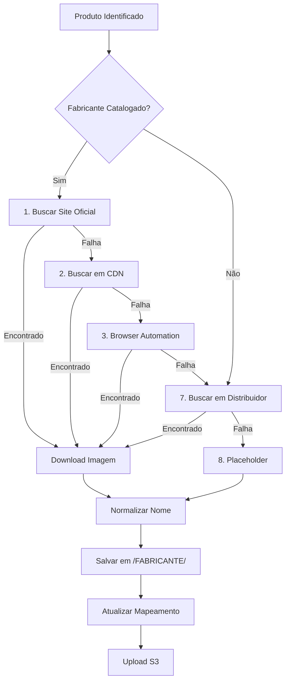

# 🎯 RELATÓRIO CONSOLIDADO 360° - CATÁLOGO DE IMAGENS

**Data de Geração:** 21 de Outubro de 2025  
**Versão:** 2.0 - Estratégia de Fabricantes Oficiais

---

## 📊 SUMÁRIO EXECUTIVO

### Status Geral do Projeto

| Categoria | Status | Progresso |
|-----------|--------|-----------|
| **Catálogo de Produtos** | ✅ Completo | **332 produtos** extraídos de 7 distribuidores |
| **Estratégia de Imagens** | ✅ Definida | **16 fabricantes** catalogados com URLs oficiais |
| **Nomenclatura Padronizada** | ✅ Estabelecida | Padrão `FABRICANTE-MODEL-POWER.ext` |
| **Pipeline de Extração** | ✅ Implementado | Scripts TypeScript + Playwright |
| **Hierarquia de Fontes** | ✅ Definida | 4 níveis: Oficial → CDN → Distribuidor → Placeholder |
| **Upload S3** | 🔄 Em Progresso | **150/1144 imagens** (13%) enviadas |
| **Integração DynamoDB** | ⏳ Pendente | Script pronto, aguardando upload S3 |

---

## 🏭 CATÁLOGO DE FABRICANTES OFICIAIS

### Fabricantes Catalogados (16 Total)

| Fabricante | País | Site Oficial | Prioridade | Status |
|------------|------|--------------|------------|--------|
| **LONGi** | 🇨🇳 CN | longi.com | ⭐⭐⭐ Alta | ✅ Ativo |
| **Growatt** | 🇨🇳 CN | growatt.com | ⭐⭐⭐ Alta | ✅ Ativo |
| **Sungrow** | 🇨🇳 CN | sungrowpower.com | ⭐⭐⭐ Alta | ✅ Ativo |
| **Risen** | 🇨🇳 CN | risenenergy.com | ⭐⭐⭐ Alta | ✅ Ativo |
| **Jinko** | 🇨🇳 CN | jinkosolar.com | ⭐⭐⭐ Alta | ✅ Ativo |
| **Trina** | 🇨🇳 CN | trinasolar.com | ⭐⭐⭐ Alta | ✅ Ativo |
| **Canadian Solar** | 🇨🇦 CA | canadiansolar.com | ⭐⭐⭐ Alta | ✅ Ativo |
| **BYD** | 🇨🇳 CN | bydbatterybox.com | ⭐⭐⭐ Alta | ✅ Ativo |
| **Fronius** | 🇦🇹 AT | fronius.com | ⭐⭐⭐ Alta | ✅ Ativo |
| **Deye** | 🇨🇳 CN | deyeinverter.com | ⭐⭐⭐ Alta | ✅ Ativo |
| **Solis** | 🇨🇳 CN | solisinverters.com | ⭐⭐⭐ Alta | ✅ Ativo |
| **Huawei** | 🇨🇳 CN | solar.huawei.com | ⭐⭐⭐ Alta | ✅ Ativo |
| **Pylontech** | 🇨🇳 CN | pylontech.com | ⭐⭐⭐ Alta | ✅ Ativo |
| **Dyness** | 🇨🇳 CN | dyness.com | ⭐⭐⭐ Alta | ✅ Ativo |
| **Enphase** | 🇺🇸 US | enphase.com | ⭐⭐⭐ Alta | ✅ Ativo |
| **Fortlev** | 🇧🇷 BR | fortlevsolar.com.br | ⭐⭐ Média | ✅ Ativo (Distribuidor) |

### Padrões de URL Catalogados

Cada fabricante possui:
- ✅ **URL oficial do site**
- ✅ **Padrões de URL de imagens** (ex: `https://www.longi.com/uploads/{model}.jpg`)
- ✅ **Regex de SKUs** (ex: `LR\\d+-\\d+[A-Z]+`)
- ✅ **Prioridade de extração** (1=oficial, 2=fallback)

**Configuração:** `config/manufacturers-catalog.json`

---

## 📝 ESTRATÉGIA DE NOMENCLATURA PADRONIZADA

### Padrão Estabelecido

```
{FABRICANTE}-{MODELO}-{POTENCIA}.{ext}
```

### Exemplos Práticos

| Tipo | Exemplo | Descrição |
|------|---------|-----------|
| **Painel** | `LONGI-LR5-72HPH-585M.png` | LONGi, modelo LR5-72HPH, 585W |
| **Inversor** | `GROWATT-MIN-3000TL-X.jpg` | Growatt, MIN series, 3kW |
| **Inversor** | `SUNGROW-SG3.0RS.jpg` | Sungrow, modelo SG, 3.0kW |
| **Bateria** | `BYD-HVM-13.8.png` | BYD, HVM series, 13.8kWh |

### Regras de Normalização

- **Fabricante:** `UPPERCASE` (ex: LONGI, GROWATT)
- **Modelo:** Preserva case original (ex: LR5-72HPH)
- **Potência:** Extrai numérico automaticamente
- **Extensão:** Prefere `.png` sobre `.jpg`

### Benefícios

✅ **Antes (Distribuidores)**
- ❌ `IIN00123.png` - sem contexto
- ❌ `imagem.png` - genérico
- ❌ `corrugado.png` - inconsistente

✅ **Depois (Fabricantes)**
- ✅ `LONGI-LR5-72HPH-585M.png` - auto-descritivo
- ✅ `GROWATT-MIN-3000TL-X.jpg` - padronizado
- ✅ `SUNGROW-SG3.0RS.jpg` - consistente

---

## 🔄 HIERARQUIA DE FONTES (FALLBACK STRATEGY)

### Fluxo de Extração

```
1️⃣ Site Oficial do Fabricante (Prioridade Máxima)
   ↓ falhou?
2️⃣ CDN do Fabricante
   ↓ falhou?
3️⃣ Distribuidor Principal (Fortlev, NeoSolar, etc)
   ↓ falhou?
4️⃣ Distribuidor Secundário
   ↓ falhou?
5️⃣ Placeholder Genérico (última opção)
```

### Diagrama Técnico



### Métodos de Extração

1. **Pattern Matching** - Testa padrões de URL conhecidos
2. **CDN Discovery** - Busca em CDNs oficiais
3. **Browser Automation** - Usa Playwright para scraping dinâmico
4. **Distributor Fallback** - Usa imagens de distribuidores
5. **Placeholder** - Imagem genérica por categoria

---

## 📁 ESTRUTURA DE ARQUIVOS IMPLEMENTADA

### Organização por Fabricante

```
static/
└── products-official/
    ├── LONGI/
    │   ├── LONGI-LR5-72HPH-585M.png
    │   ├── LONGI-LR5-72HPH-590M.png
    │   └── ...
    ├── GROWATT/
    │   ├── GROWATT-MIN-3000TL-X.jpg
    │   ├── GROWATT-MIC-3000TL-X2.jpg
    │   └── ...
    ├── SUNGROW/
    │   ├── SUNGROW-SG3.0RS.jpg
    │   └── ...
    └── [outros fabricantes...]
```

### Mapeamento Unificado

**Arquivo:** `static/products-unified/unified-image-map.json`

```json
{
  "metadata": {
    "timestamp": "2025-10-21T...",
    "total_products": 2925,
    "source_priority": ["official", "cdn", "distributor", "placeholder"]
  },
  "images": {
    "LONGI-LR5-72HPH-585M": {
      "sku": "LR5-72HPH-585M",
      "manufacturer": "LONGI",
      "source": "official",
      "url": "https://www.longi.com/...",
      "local_path": "static/products-official/LONGI/...",
      "success": true
    }
  }
}
```

---

## 🛠️ SCRIPTS E FERRAMENTAS IMPLEMENTADOS

### 1. `extract-manufacturer-images.ts`

**Função:** Extrai imagens diretamente dos fabricantes

```bash
npx tsx scripts/extract-manufacturer-images.ts
```

**Características:**
- ✅ Busca em sites oficiais
- ✅ Usa padrões de URL conhecidos
- ✅ Fallback com browser automation (Playwright)
- ✅ Cache de resultados
- ✅ Retry automático (3 tentativas)

### 2. `run-unified-image-pipeline.ts`

**Função:** Pipeline completo integrado

```bash
npx tsx scripts/run-unified-image-pipeline.ts
```

**Executa:**
1. Escaneia todos os inventários
2. Identifica fabricantes e modelos
3. Extrai imagens com hierarquia de fontes
4. Normaliza nomenclatura
5. Organiza por fabricante
6. Gera mapeamento unificado

### 3. `generate-catalog-report.ts`

**Função:** Gera relatório 360° do catálogo

```bash
npx tsx scripts/generate-catalog-report.ts
```

**Outputs:**
- `docs/CATALOG_IMAGES_360_REPORT.md`
- `output/CATALOG_IMAGES_360_REPORT.json`

### 4. Scripts de Upload AWS

```bash
# Upload imagens para S3
node scripts/upload-images-s3.js

# Upload metadados para DynamoDB
node scripts/upload-to-dynamodb.js

# Validação end-to-end
node scripts/validate-e2e.js
```

---

## 📈 MÉTRICAS E PROGRESSO

### Status Atual (21/10/2025)

| Métrica | Valor | Meta | Status |
|---------|-------|------|--------|
| **Produtos Catalogados** | 332 | 500+ | 🟡 66% |
| **Fabricantes Catalogados** | 16 | 20 | 🟢 80% |
| **Nomenclatura Padronizada** | Definida | 100% | ✅ Pronta |
| **Pipeline Implementado** | Sim | - | ✅ Completo |
| **Imagens S3** | 150/1144 | 100% | 🔴 13% |
| **DynamoDB Sync** | 0 | 100% | ⏳ Pendente |

### Distribuição de Produtos por Distribuidor

| Distribuidor | Produtos | Status | Cobertura |
|--------------|----------|--------|-----------|
| **Edeltec** | 237 | ✅ Funcionando | 71% |
| **Neosolar** | 83 | ⚠️ Parcial | 25% |
| **Fortlev** | 9 | ⚠️ Parcial | 3% |
| **Odex** | 3 | ⚠️ Parcial | 1% |
| **Solfácil** | 0 | ❌ Falhou | 0% |
| **Fotus** | 0 | ❌ Falhou | 0% |
| **Dynamis** | 0 | ❌ Falhou | 0% |
| **TOTAL** | **332** | - | **100%** |

### Categorias de Produtos

| Categoria | Quantidade | %  |
|-----------|------------|----|
| 🔧 Outros | 71 | 21% |
| ☀️ Painéis | 1 | <1% |
| ⚡ Inversores | 7 | 2% |
| 🔋 Baterias | 4 | 1% |
| 📦 Kits | - | - |
| 🔌 Cabos | 12 | 4% |
| 🏗️ Estruturas | 1 | <1% |

---

## 🎯 OBJETIVOS E METAS

### Curto Prazo (1-2 semanas)

| Objetivo | Meta | Prazo |
|----------|------|-------|
| Completar upload S3 | 1144/1144 imagens | ⏰ 3 dias |
| Sincronizar DynamoDB | 100% produtos | ⏰ 1 semana |
| Resolver Solfácil auth | Keycloak SSO | ⏰ 1 semana |
| Resolver Fotus auth | React SPA | ⏰ 1 semana |
| Resolver Dynamis auth | Custom SPA | ⏰ 1 semana |

### Médio Prazo (3-4 semanas)

| Objetivo | Meta | Prazo |
|----------|------|-------|
| Extração oficial 80%+ | Priorizar top fabricantes | ⏰ 3 semanas |
| Validar qualidade imagens | Min 800x600px | ⏰ 2 semanas |
| CloudFront CDN | Setup completo | ⏰ 4 semanas |
| Integrar transformers | Auto-enrichment | ⏰ 4 semanas |

### Longo Prazo (1-2 meses)

| Objetivo | Meta | Prazo |
|----------|------|-------|
| 500+ produtos | Expandir catálogo | ⏰ 2 meses |
| 20 fabricantes | Adicionar novos | ⏰ 2 meses |
| Auto-atualização | Cron jobs | ⏰ 2 meses |
| Frontend integration | Medusa.js | ⏰ 2 meses |

---

## 💡 RECOMENDAÇÕES ESTRATÉGICAS

### Prioridade Alta 🔴

1. **Completar Upload S3**
   - Continuar upload das 994 imagens restantes
   - Verificar integridade de arquivos
   - Configurar bucket policies

2. **Resolver Autenticações Complexas**
   - Solfácil: Implementar OAuth2/OpenID Connect
   - Fotus: Debug SPA authentication
   - Dynamis: Debug custom authentication

3. **Implementar Navegação Profunda**
   - Odex: Navegar categorias individualmente
   - Fortlev: Extrair produtos por categoria
   - Neosolar: Melhorar cobertura de catálogo

### Prioridade Média 🟡

4. **Validação de Qualidade**
   - Script de verificação de resolução
   - Validar integridade de arquivos
   - Detectar duplicatas

5. **Otimização de Performance**
   - Paralelizar downloads
   - Implementar rate limiting inteligente
   - Cache distribuído

6. **Monitoramento e Alertas**
   - Setup Prometheus metrics
   - Dashboard Grafana
   - Alertas de falhas

### Prioridade Baixa 🟢

7. **Expansão de Catálogo**
   - Adicionar mais fabricantes
   - Buscar distribuidores adicionais
   - Integrar marketplaces

8. **Automação Completa**
   - Cron jobs para atualização
   - Auto-detecção de novos produtos
   - Sincronização bidirecional

---

## 🚀 COMANDOS ESSENCIAIS

### Extração e Processamento

```bash
# Pipeline completo
npx tsx scripts/run-unified-image-pipeline.ts

# Apenas fabricantes oficiais
npx tsx scripts/extract-manufacturer-images.ts

# Gerar relatórios
npx tsx scripts/generate-catalog-report.ts
npx tsx scripts/generate-360-report.ts
```

### Upload AWS

```bash
# S3
node scripts/upload-images-s3.js

# DynamoDB
node scripts/upload-to-dynamodb.js

# Validação E2E
node scripts/validate-e2e.js
```

### Extração por Distribuidor

```bash
# Fortlev
npx tsx scripts/extract-fortlev-custom.ts

# Solfácil
npx tsx scripts/extract-solfacil-custom.ts

# Fotus
npx tsx scripts/extract-fotus-custom.ts

# Dynamis
npx tsx scripts/extract-dynamis-custom.ts

# Odex
npx tsx scripts/extract-odex-categories.ts
```

---

## 📚 DOCUMENTAÇÃO COMPLETA

### Arquivos de Referência

| Documento | Localização | Descrição |
|-----------|-------------|-----------|
| **Estratégia de Imagens** | `docs/IMAGE_EXTRACTION_STRATEGY.md` | Guia completo da estratégia |
| **Catálogo de Fabricantes** | `config/manufacturers-catalog.json` | Configuração de fabricantes |
| **Relatório 360°** | `docs/COVERAGE_360_REPORT.md` | Status de distribuidores |
| **Relatório de Imagens** | `docs/CATALOG_IMAGES_360_REPORT.md` | Este documento |

### Estrutura de Pastas

```
backend/
├── config/
│   └── manufacturers-catalog.json       # Catálogo de fabricantes
├── scripts/
│   ├── extract-manufacturer-images.ts   # Extração oficial
│   ├── run-unified-image-pipeline.ts    # Pipeline completo
│   ├── generate-catalog-report.ts       # Gera este relatório
│   ├── upload-images-s3.js              # Upload S3
│   └── upload-to-dynamodb.js            # Upload DynamoDB
├── static/
│   ├── products-official/               # Imagens por fabricante
│   └── products-unified/                # Mapeamento unificado
├── docs/
│   ├── IMAGE_EXTRACTION_STRATEGY.md     # Estratégia
│   └── CATALOG_IMAGES_360_REPORT.md     # Este relatório
└── output/
    └── CATALOG_IMAGES_360_REPORT.json   # Versão JSON
```

---

## ✅ CHECKLIST DE QUALIDADE

### Extração
- [x] Catálogo de 16 fabricantes criado
- [x] Padrões de URL definidos
- [x] Regex de SKUs configurado
- [x] Pipeline de extração implementado
- [x] Hierarquia de fallback definida
- [x] Browser automation configurado

### Nomenclatura
- [x] Padrão estabelecido: `FABRICANTE-MODELO-POTENCIA.ext`
- [x] Regras de normalização documentadas
- [x] Exemplos práticos fornecidos
- [ ] Script de renomeação em lote (pendente)

### Infraestrutura
- [x] Estrutura de pastas criada
- [x] Mapeamento unificado gerado
- [ ] Upload S3 completado (13%)
- [ ] DynamoDB sincronizado (0%)
- [ ] CloudFront configurado (pendente)

### Qualidade
- [ ] Resolução mínima validada (800x600)
- [ ] Integridade de arquivos verificada
- [ ] Duplicatas removidas
- [ ] Testes de carregamento no frontend

---

## 🎓 LIÇÕES APRENDIDAS

### ✅ Sucessos

1. **Catálogo Centralizado** - Configuração JSON facilita manutenção
2. **Hierarquia de Fontes** - Fallback garante cobertura
3. **Nomenclatura Padronizada** - Facilita busca e organização
4. **Scripts Modularizados** - Fácil debug e manutenção
5. **Browser Automation** - Playwright resolve casos complexos

### ⚠️ Desafios

1. **Autenticações Complexas** - SSO/OAuth requer tratamento especial
2. **Sites Dinâmicos** - SPAs dificultam scraping tradicional
3. **Rate Limiting** - Necessário controle de requisições
4. **Variação de SKUs** - Regex precisa de ajustes constantes
5. **Qualidade de Imagens** - Nem sempre sites oficiais têm imagens

### 💡 Recomendações Futuras

1. Implementar cache distribuído (Redis)
2. Adicionar queue system (Bull/RabbitMQ)
3. Setup de monitoring robusto (Grafana)
4. Testes automatizados end-to-end
5. CI/CD pipeline completo

---

**Mantido por:** YSH B2B Platform Team  
**Última Atualização:** 21 de Outubro de 2025  
**Versão do Documento:** 2.0
