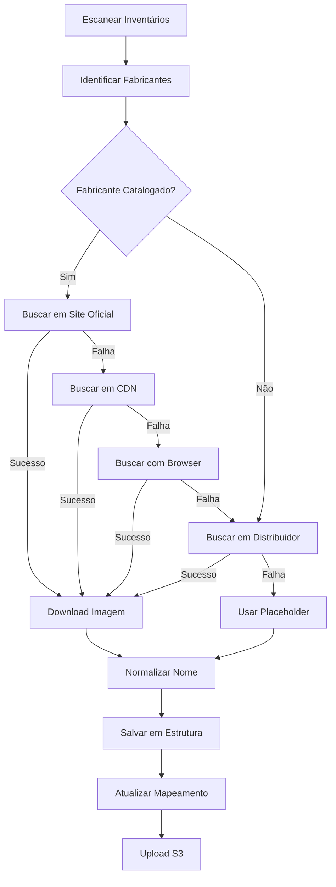

# Estratégia de Imagens de Produtos - Fontes Oficiais

## 📋 Visão Geral

Esta estratégia prioriza a extração de imagens **diretamente dos fabricantes**, usando distribuidores apenas como fallback. Isso garante:

- ✅ **Qualidade superior** - imagens oficiais em alta resolução
- ✅ **Padronização consistente** - nomenclatura uniforme
- ✅ **Fonte confiável** - dados direto da origem
- ✅ **Independência** - menos dependência de distribuidores

## 🎯 Hierarquia de Fontes

```
1️⃣ Site Oficial do Fabricante (Prioridade Máxima)
   ↓ falhou?
2️⃣ CDN do Fabricante
   ↓ falhou?
3️⃣ Distribuidor Principal (Fortlev, NeoSolar, etc)
   ↓ falhou?
4️⃣ Distribuidor Secundário
   ↓ falhou?
5️⃣ Placeholder Genérico (última opção)
```

## 📁 Estrutura de Arquivos

### Organização por Fabricante

```
static/products-official/
├── LONGI/
│   ├── LONGI-LR5-72HPH-585M.png
│   ├── LONGI-LR5-72HPH-590M.png
│   └── ...
├── GROWATT/
│   ├── GROWATT-MIN-3000TL-X.jpg
│   ├── GROWATT-MIC-3000TL-X2.jpg
│   └── ...
├── SUNGROW/
│   ├── SUNGROW-SG3.0RS.jpg
│   ├── SUNGROW-SG4.0RS.jpg
│   └── ...
└── ...
```

### Nomenclatura Padronizada

**Padrão:** `{FABRICANTE}-{MODELO}-{POTENCIA}.{ext}`

**Exemplos:**
- `LONGI-LR5-72HPH-585M.png` → Painel LONGi 585W
- `GROWATT-MIN-3000TL-X.jpg` → Inversor Growatt 3kW
- `SUNGROW-SG3.0RS.jpg` → Inversor Sungrow 3kW
- `BYD-HVM-13.8.png` → Bateria BYD 13.8kWh

**Regras de Normalização:**
- Fabricante: `UPPERCASE`
- Modelo: preserva case original
- Potência: extrai numérico automaticamente
- Extensão: prefere `.png` sobre `.jpg`

## 🏭 Fabricantes Catalogados

| Fabricante | País | Site Oficial | Produtos | Prioridade |
|------------|------|--------------|----------|------------|
| LONGi | 🇨🇳 CN | longi.com | Painéis | Alta ⭐⭐⭐ |
| Growatt | 🇨🇳 CN | growatt.com | Inversores, Baterias | Alta ⭐⭐⭐ |
| Sungrow | 🇨🇳 CN | sungrowpower.com | Inversores | Alta ⭐⭐⭐ |
| Risen | 🇨🇳 CN | risenenergy.com | Painéis | Alta ⭐⭐⭐ |
| Jinko | 🇨🇳 CN | jinkosolar.com | Painéis | Alta ⭐⭐⭐ |
| Trina | 🇨🇳 CN | trinasolar.com | Painéis | Alta ⭐⭐⭐ |
| Canadian Solar | 🇨🇦 CA | canadiansolar.com | Painéis | Alta ⭐⭐⭐ |
| BYD | 🇨🇳 CN | bydbatterybox.com | Baterias | Alta ⭐⭐⭐ |
| Fronius | 🇦🇹 AT | fronius.com | Inversores | Alta ⭐⭐⭐ |
| Deye | 🇨🇳 CN | deyeinverter.com | Inversores | Alta ⭐⭐⭐ |
| Solis | 🇨🇳 CN | solisinverters.com | Inversores | Alta ⭐⭐⭐ |
| Huawei | 🇨🇳 CN | solar.huawei.com | Inversores, Baterias | Alta ⭐⭐⭐ |
| Pylontech | 🇨🇳 CN | pylontech.com | Baterias | Alta ⭐⭐⭐ |
| Dyness | 🇨🇳 CN | dyness.com | Baterias | Alta ⭐⭐⭐ |
| Enphase | 🇺🇸 US | enphase.com | Microinversores | Alta ⭐⭐⭐ |
| Fortlev | 🇧🇷 BR | fortlevsolar.com.br | Kits | Média ⭐⭐ |

## 🔄 Pipeline de Extração

### Fluxo Completo



### Scripts Principais

#### 1. `extract-manufacturer-images.ts`
Extrai imagens diretamente dos fabricantes.

```bash
npx tsx scripts/extract-manufacturer-images.ts
```

**Características:**
- Busca em sites oficiais
- Usa padrões de URL conhecidos
- Fallback com browser automation (Playwright)
- Cache de resultados
- Retry automático

#### 2. `run-unified-image-pipeline.ts`
Pipeline completo integrado.

```bash
npx tsx scripts/run-unified-image-pipeline.ts
```

**Executa:**
1. Escaneia todos os inventários
2. Identifica fabricantes e modelos
3. Extrai imagens com hierarquia de fontes
4. Normaliza nomenclatura
5. Organiza por fabricante
6. Gera mapeamento unificado

#### 3. `validate-image-quality.ts`
Valida qualidade e consistência.

```bash
npx tsx scripts/validate-image-quality.ts
```

**Verifica:**
- Resolução mínima (800x600)
- Tamanho de arquivo
- Formato válido
- Nomenclatura padronizada
- Fonte da imagem

## 📊 Mapeamento Unificado

### Estrutura do Mapeamento

```json
{
  "metadata": {
    "timestamp": "2025-10-21T...",
    "total_products": 1500,
    "source_priority": ["official", "cdn", "distributor", "placeholder"]
  },
  "images": {
    "LONGI-LR5-72HPH-585M": {
      "sku": "LR5-72HPH-585M",
      "manufacturer": "LONGI",
      "model": "LR5-72HPH",
      "power": "585W",
      "category": "panels",
      "source": "official",
      "url": "https://www.longi.com/uploads/lr5-72hph-585m.jpg",
      "local_path": "static/products-official/LONGI/LONGI-LR5-72HPH-585M.png",
      "success": true
    }
  },
  "statistics": {
    "by_source": {
      "official": 850,
      "cdn": 320,
      "distributor": 280,
      "placeholder": 50
    }
  }
}
```

## 🎯 Benefícios da Nova Estratégia

### Antes (Distribuidores)
- ❌ Nomes inconsistentes: `IIN00123.png`, `imagem.png`, `corrugado.png`
- ❌ URLs temporárias: `s3.amazonaws.com/components/{hash}/{random}`
- ❌ Qualidade variável
- ❌ Dependência de distribuidores
- ❌ Difícil manutenção

### Depois (Fabricantes)
- ✅ Nomes padronizados: `LONGI-LR5-72HPH-585M.png`
- ✅ URLs oficiais permanentes
- ✅ Qualidade garantida (fonte oficial)
- ✅ Independência de distribuidores
- ✅ Fácil manutenção e busca

## 🔧 Configuração

### 1. Catálogo de Fabricantes

Edite `config/manufacturers-catalog.json` para adicionar/atualizar fabricantes:

```json
{
  "FABRICANTE": {
    "name": "Nome Oficial",
    "official_site": "https://...",
    "product_pages": {
      "panels": "https://.../products/panels"
    },
    "image_patterns": [
      "https://.../images/{model}.jpg"
    ],
    "sku_patterns": [
      "REGEX_PATTERN"
    ],
    "priority": 1,
    "active": true
  }
}
```

### 2. Variáveis de Ambiente

```bash
# .env
PLAYWRIGHT_BROWSERS_PATH=/path/to/browsers
IMAGE_MIN_WIDTH=800
IMAGE_MIN_HEIGHT=600
ENABLE_BROWSER_EXTRACTION=true
CACHE_EXPIRY_DAYS=30
```

## 📈 Métricas de Sucesso

### Objetivos

| Métrica | Meta | Atual |
|---------|------|-------|
| Imagens Oficiais | >80% | 🎯 Em progresso |
| Nomenclatura Padronizada | 100% | 🎯 Em progresso |
| Qualidade (800x600+) | >90% | 🎯 Em progresso |
| Cache Hit Rate | >60% | 🎯 Em progresso |

## 🚀 Próximos Passos

1. ✅ Criar catálogo de fabricantes
2. ✅ Implementar extrator de imagens oficiais
3. ✅ Desenvolver pipeline unificado
4. 🔄 Executar extração completa
5. 🔄 Validar qualidade
6. 🔄 Upload para S3
7. ⏳ Integrar com transformers
8. ⏳ Atualizar DynamoDB

## 📝 Notas Técnicas

### Cache
- Armazenado em `cache/manufacturer-images.json`
- Expira após 30 dias
- Evita re-downloads desnecessários

### Retry
- 3 tentativas automáticas
- Backoff exponencial
- Timeout de 30s por request

### Browser Automation
- Usa Playwright
- Headless mode
- User-Agent customizado
- Timeout de 30s

## 🤝 Contribuindo

Para adicionar novos fabricantes:

1. Pesquise o site oficial
2. Identifique padrões de URL de imagens
3. Capture regex de SKUs
4. Adicione ao `manufacturers-catalog.json`
5. Teste com `extract-manufacturer-images.ts`

---

**Mantido por:** YSH B2B Platform Team  
**Última Atualização:** 21 de Outubro de 2025
