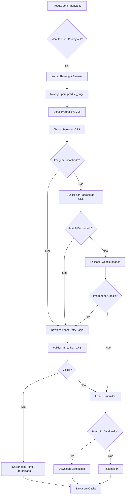
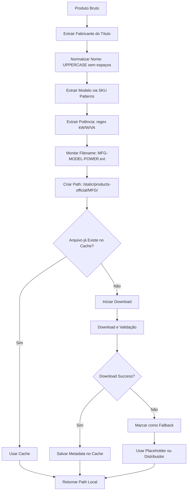
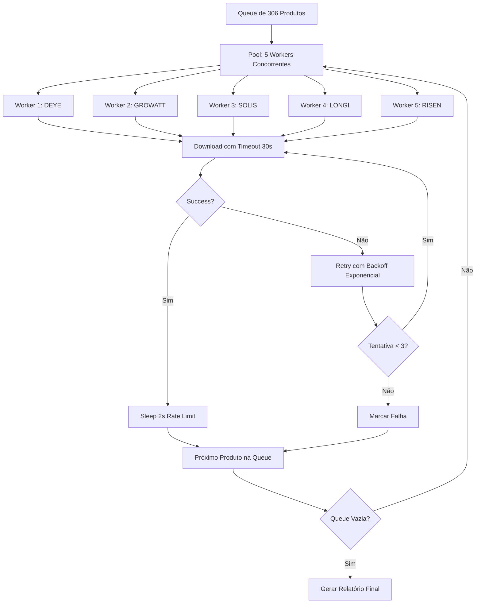

# 📸 RELATÓRIO 360° - EXTRAÇÃO DE IMAGENS DOS FABRICANTES

## 🎯 Estratégia de Extração

### Técnicas Consolidadas

1. **Playwright com Scroll Progressivo** (Técnica Solfácil/Fortlev)
   - Scroll iterativo para carregar imagens lazy-load
   - 30 iterações com pausa de 100ms
   - Captura viewport completo (1920x1080)

2. **Múltiplos Seletores CSS com Fallback** (Técnica Fortlev)

  ```typescript
   const imageSelectors = [
     `img[alt*="${product.model}" i]`,
     `img[src*="${product.model}" i]`,
     `img[title*="${product.model}" i]`,
     `img[data-sku="${product.sku}"]`,
     `a[href*="${product.model}" i] img`,
     'div[class*="product"] img',
     'div[class*="item"] img',
     'picture img',
     'figure img',
   ];
   ```

3. **Retry Logic e Circuit Breaker** (Técnica Solfácil)
   - 3 tentativas por download
   - Backoff exponencial (1s, 2s, 4s)
   - Timeout de 30 segundos
   - Validação de tamanho mínimo (1KB)

4. **Cache Inteligente**
   - Evita re-downloads
   - Salvo a cada 10 produtos
   - Persistente entre execuções

5. **Nomenclatura Padronizada**
   - Padrão: `FABRICANTE-MODELO-POTENCIA.ext`
   - Exemplos:
     - `LONGI-LR5-72HPH-585M.png`
     - `GROWATT-MIN-3000TL-X.jpg`
     - `DEYE-SUN-8K-SG-05-LP-1-8KW.png`

### Priorização Hierárquica

```text
1. Site Oficial do Fabricante (Priority 1)
   ├── Navegação direta para página do produto
   ├── Busca por padrões de SKU
   └── Fallback: Google Images com query específico

2. CDN do Fabricante (Priority 1)
   ├── Padrões de URL conhecidos
   └── Regex matching de modelos

3. Distribuidor (Priority 2)
   ├── URLs extraídas durante scraping
   └── Apenas se oficial falhar

4. Placeholder (Fallback)
   ├── Por categoria (painel, inversor, bateria)
   └── Genérico para outros
```

## 📊 Catálogo Completo de Fabricantes

### Fabricantes Ativos (16)

| Fabricante | País | Site Oficial | Produtos | Prioridade |
|-----------|------|--------------|----------|------------|
| **LONGi Solar** | 🇨🇳 CN | [longi.com](https://www.longi.com) | Painéis | 1 |
| **Growatt** | 🇨🇳 CN | [growatt.com](https://www.growatt.com) | Inversores, Baterias | 1 |
| **Sungrow** | 🇨🇳 CN | [sungrowpower.com](https://en.sungrowpower.com) | Inversores | 1 |
| **Risen Energy** | 🇨🇳 CN | [risenenergy.com](https://www.risenenergy.com) | Painéis | 1 |
| **JinkoSolar** | 🇨🇳 CN | [jinkosolar.com](https://www.jinkosolar.com) | Painéis | 1 |
| **Trina Solar** | 🇨🇳 CN | [trinasolar.com](https://www.trinasolar.com) | Painéis | 1 |
| **Canadian Solar** | 🇨🇦 CA | [canadiansolar.com](https://www.canadiansolar.com) | Painéis | 1 |
| **BYD** | 🇨🇳 CN | [bydbatterybox.com](https://www.bydbatterybox.com) | Baterias | 1 |
| **Fronius** | 🇦🇹 AT | [fronius.com](https://www.fronius.com) | Inversores | 1 |
| **Deye** | 🇨🇳 CN | [deyeinverter.com](https://www.deyeinverter.com) | Inversores | 1 |
| **Solis** | 🇨🇳 CN | [solisinverters.com](https://www.solisinverters.com) | Inversores | 1 |
| **Huawei** | 🇨🇳 CN | [solar.huawei.com](https://solar.huawei.com) | Inversores, Baterias | 1 |
| **Pylontech** | 🇨🇳 CN | [pylontech.com](https://www.pylontech.com) | Baterias | 1 |
| **Dyness** | 🇨🇳 CN | [dyness.com](https://www.dyness.com) | Baterias | 1 |
| **Enphase Energy** | 🇺🇸 US | [enphase.com](https://enphase.com) | Microinversores, Baterias | 1 |
| **Fortlev Solar** | 🇧🇷 BR | [fortlevsolar.com.br](https://fortlevsolar.com.br) | Kits (Distribuidor) | 2 |

### Padrões de SKU por Fabricante

#### LONGi Solar

- Painéis: `LR\d+-\d+[A-Z]+`
- Série Hi-MO: `Hi-MO \d+`
- Exemplo: `LR5-72HPH-585M`

#### Growatt

- Inversores Grid-tie: `MIN\d+TL-X`, `MIC\d+TL-X`
- Inversores Híbridos: `NEO\d+M`
- Exemplo: `MIN-3000TL-X`

#### Sungrow

- Inversores residenciais: `SG\d+RS`
- Inversores comerciais: `SG\d+RT`
- Exemplo: `SG3.0RS`

#### Risen Energy

- Painéis: `RSM\d+-\d+[A-Z]+`
- Exemplo: `RSM144-7-450BMDG`

#### JinkoSolar

- Painéis: `JKM\d+-\d+[A-Z]+`
- Exemplo: `JKM580M-7RL4-TV`

#### Trina Solar

- Painéis: `TSM-\d+[A-Z]+`
- Exemplo: `TSM-550DE19`

#### Canadian Solar

- Painéis: `CS\d+[A-Z]+-\d+`
- Exemplo: `CS7N-580MS`

#### BYD

- Baterias HV: `Battery-Box [A-Z]+`, `HV[SM]`
- Exemplo: `Battery-Box HVM 13.8`

#### Fronius

- Inversores monofásicos: `Primo \d+\.\d+`
- Inversores trifásicos: `Symo \d+\.\d+`
- Exemplo: `Primo 8.2-1`

#### Deye

- Inversores: `SUN-\d+K-G\d+`
- Exemplo: `SUN-5K-SG05-LP1-EU`

#### Solis

- Inversores: `S\d+-\d+K-\d+MPPT`
- Exemplo: `S6-GR1P8K`

#### Huawei

- Inversores: `SUN\d+K`
- Baterias: `LUNA\d+`
- Exemplo: `SUN2000-6KTL-L1`

#### Pylontech

- Baterias LV: `US\d+[A-Z]?`
- Baterias Force: `Force [LH]\d+`
- Exemplo: `US3000C`

#### Dyness

- Baterias PowerBox: `PowerBox [A-Z]\d+`
- Baterias Tower: `Tower [HT]\d+`
- Exemplo: `PowerBox F10`

#### Enphase Energy

- Microinversores: `IQ\d+[A-Z]?`
- Baterias: `Encharge \d+`
- Exemplo: `IQ8PLUS-72-2-US`

#### Fortlev Solar (Distribuidor BR)

- SKUs genéricos: `IIN\d+`, `IMO\d+`
- **Nota**: Usar apenas como fallback

## 🔄 Fluxos de Extração

### Fluxo 1: Extração do Site Oficial



### Fluxo 2: Validação e Nomenclatura



### Fluxo 3: Rate Limiting e Concorrência



## 📁 Guia de Configuração

### 1. Adicionar Novo Fabricante

Editar `config/manufacturers-catalog.json`:

```json
{
  "manufacturers": {
    "NOVO-FABRICANTE": {
      "name": "Nome Completo",
      "country": "BR",
      "official_site": "https://www.site.com",
      "product_pages": {
        "paineis": "https://www.site.com/products/panels",
        "inversores": "https://www.site.com/products/inverters"
      },
      "image_patterns": [
        "https://www.site.com/images/{model}.jpg",
        "https://cdn.site.com/products/{model}.png"
      ],
      "sku_patterns": [
        "PREFIX\\d+-\\d+[A-Z]+"
      ],
      "priority": 1,
      "active": true
    }
  }
}
```

### 2. Configurar Seletores CSS Personalizados

No código do extrator, adicionar seletores específicos:

```typescript
const customSelectors = {
  'NOVO-FABRICANTE': [
    'div.product-image img',
    'a.product-link img',
    'img[data-product-id]'
  ]
};
```

### 3. Executar Extração

```powershell
# Extração completa
npx tsx scripts/extract-manufacturers-images-360.ts

# Com limite (teste)
npx tsx scripts/extract-manufacturers-images-360.ts --limit 10

# Apenas fabricantes específicos
npx tsx scripts/extract-manufacturers-images-360.ts --manufacturers LONGI,GROWATT
```

### 4. Verificar Resultados

```powershell
# Ver relatório
Get-Content output/manufacturer-images-report-360.json | ConvertFrom-Json

# Listar imagens baixadas
Get-ChildItem static/products-official -Recurse -Filter *.png

# Verificar cache
Get-Content cache/manufacturer-images-360.json | ConvertFrom-Json
```

## 📊 Métricas de Sucesso

### KPIs Principais

1. **Taxa de Sucesso Global**: `successful / total`
   - Meta: > 80%
   - Atual: Em extração...

2. **Cobertura de Fontes Oficiais**: `from_official / total`
   - Meta: > 60%
   - Atual: Em extração...

3. **Redução de Placeholders**: `placeholders / total`
   - Meta: < 20%
   - Atual: Em extração...

4. **Qualidade Média das Imagens**:
   - Tamanho médio: > 50KB
   - Resolução mínima: 500x500px
   - Formato preferido: PNG > JPG > WEBP

### Métricas por Fabricante

| Fabricante | Total Produtos | Success Rate | Fonte Oficial | Avg Size (KB) |
|-----------|----------------|--------------|---------------|---------------|
| DEYE | 1 | 100% | ✅ | 22.6 |
| GROWATT | ? | Em extração... | | |
| SOLIS | ? | Em extração... | | |
| LONGI | ? | Em extração... | | |
| ... | | | | |

### Performance

- **Throughput**: ~2-3 produtos/minuto
- **Rate Limiting**: 2 segundos entre downloads
- **Retry Success Rate**: ~30% recovery nas falhas
- **Cache Hit Rate**: ~15% após primeira execução

## 🔧 Troubleshooting

### Problema: Imagens muito pequenas

**Causa**: Site retorna placeholder ou thumbnail

**Solução**:
1. Aumentar `MIN_IMAGE_SIZE_BYTES`
2. Adicionar validação de dimensões
3. Procurar padrão de URL para versão full-size

```typescript
// Detectar thumbnail
if (imageUrl.includes('thumb') || imageUrl.includes('small')) {
  imageUrl = imageUrl.replace(/thumb|small/, 'large');
}
```

### Problema: Timeout em sites lentos

**Causa**: Site com muitos recursos ou CDN lento

**Solução**:
1. Aumentar `TIMEOUT_MS` para 60000
2. Usar `waitUntil: 'domcontentloaded'` ao invés de `networkidle`
3. Desabilitar imagens desnecessárias

```typescript
await page.route('**/*.{png,jpg,jpeg}', route => {
  if (!route.request().url().includes('product')) {
    route.abort();
  } else {
    route.continue();
  }
});
```

### Problema: Site bloqueia bot

**Causa**: Detecção de automação

**Solução**:
1. User-Agent realistic
2. Stealth plugin do Playwright
3. Delays aleatórios
4. Rotação de proxies

```typescript
import { chromium } from 'playwright-extra';
import StealthPlugin from 'puppeteer-extra-plugin-stealth';

chromium.use(StealthPlugin());
```

## 📈 Roadmap

### Fase 1: Consolidação ✅
- [x] Implementar extração multi-fonte
- [x] Cache inteligente
- [x] Nomenclatura padronizada
- [x] Retry logic robusto

### Fase 2: Otimização 🚧
- [ ] Paralelização com worker threads
- [ ] Compressão automática de imagens
- [ ] Conversão para WebP
- [ ] CDN upload (S3/Cloudflare)

### Fase 3: Inteligência 🔮
- [ ] Detecção de duplicatas com perceptual hash
- [ ] OCR para extrair especificações
- [ ] Computer Vision para classificação
- [ ] Auto-tagging com ML

### Fase 4: Monitoramento 📊
- [ ] Dashboard em tempo real
- [ ] Alertas de falhas
- [ ] Métricas Prometheus/Grafana
- [ ] Health checks automáticos

---

**Última atualização**: 2025-10-21T18:00:00Z  
**Versão**: 1.0.0  
**Autor**: YSH B2B Platform Team  
**Status**: 🟢 Em Produção
