# Grafo de Relacionamentos - YSH Solar B2B Backend

Este documento mapeia os relacionamentos e dependências entre todas as pastas e componentes do projeto backend.

## Representação Visual (Mermaid)

```mermaid
graph TD
    %% Core Application
    SRC[src/] --> API[src/api/]
    SRC --> MODULES[src/modules/]
    SRC --> WORKFLOWS[src/workflows/]
    SRC --> LINKS[src/links/]
    SRC --> JOBS[src/jobs/]
    SRC --> SUBSCRIBERS[src/subscribers/]
    SRC --> ADMIN[src/admin/]
    SRC --> SCRIPTS_SRC[src/scripts/]

    %% Dependencies
    SRC --> PACKAGE[package.json]
    SRC --> MEDUSA_CONFIG[medusa-config.ts]
    SRC --> TSCONFIG[tsconfig.json]
    SRC --> JEST_CONFIG[jest.config.js]
    SRC --> ESLINT_CONFIG[eslint.config.js]

    %% Testing
    TESTS[tests/] --> INTEGRATION_TESTS[integration-tests/]
    INTEGRATION_TESTS --> HTTP_TESTS[integration-tests/http/]
    INTEGRATION_TESTS --> MODULE_TESTS[integration-tests/modules/]
    INTEGRATION_TESTS --> UTILS_TESTS[integration-tests/utils/]

    %% Documentation
    DOCS[docs/] --> IMPLEMENTATION_DOCS[docs/implementation/]
    DOCS --> DATABASE_DOCS[docs/database/]
    DOCS --> INTEGRATION_DOCS[docs/integration/]

    %% Data Management
    DATA[data/] --> PRODUCTS_INVENTORY[data/products-inventory/]
    DATA --> ANALYSIS[data/analysis/]
    DATA --> EXPORTS[data/exports/]
    DATA --> PROJECT_HELIOS[data/project-helios/]
    DATA --> DATA_SCRIPTS[data/scripts/]

    %% Data Platform
    DATA_PLATFORM[data-platform/] --> DAGSTER[data-platform/dagster/]
    DATA_PLATFORM --> PATHWAY[data-platform/pathway/]

    %% Database
    DATABASE[database/] --> MIGRATIONS[database/migrations/]

    %% Infrastructure
    DOCKER[docker/]
    CONFIG[config/] --> KONG[config/kong.yml]
    CONFIG --> LOKI[config/loki.yml]
    CONFIG --> PROMETHEUS[config/prometheus.yml]
    CONFIG --> PROMTAIL[config/promtail.yml]
    CONFIG --> AGENTS[config/agents/]
    CONFIG --> GRAFANA[config/grafana/]
    CONFIG --> MONITORING[config/monitoring/]

    %% Scripts and Automation
    SCRIPTS[scripts/]
    BUILD[build/] --> BUILD_AWS[build/aws/]
    BUILD --> BUILD_DOCKER[build/docker/]
    BUILD --> BUILD_SCRIPTS[build/scripts/]

    %% Cloud Infrastructure
    AWS_CLOUDFORMATION[aws-cloudformation/]

    %% Initialization
    INIT_SCRIPTS[init-scripts/]

    %% External Interfaces
    STATIC[static/]
    OUTPUT[output/]
    SECRETS[secrets/]

    %% Specialized Components
    MCP_SERVERS[mcp-servers/]
    PACT[pact/]

    %% Configuration Files
    DOCKER_COMPOSE[docker-compose.yml]
    REQUIREMENTS[requirements.txt]
    RUN_EXTRACTION[run_extraction.py]
    FALLBACK_API[fallback_api.py]

    %% PowerShell Scripts
    AUTO_INIT_AWS[auto-init-aws.ps1]
    BUILD_OPTIMIZED_IMAGES[build-optimized-images.ps1]
    CLEANUP_OLD_IMAGES[cleanup-old-images.ps1]
    QUICK_AWS_SETUP[quick-aws-setup.ps1]

    %% Documentation Files
    README[README.md]
    INDEX_MD[INDEX.md]
    PROGRESSO[PROGRESSO_SEQUENCIA.md]
    REORG_SUMMARY[REORGANIZATION_SUMMARY.md]

    %% Git and Environment
    GITIGNORE[.gitignore]
    ENV_FILES[.env*]
    YARN_LOCK[yarn.lock]

    %% Relationships
    SRC --> DATABASE
    SRC --> DATA
    MODULES --> WORKFLOWS
    API --> MODULES
    WORKFLOWS --> LINKS
    HTTP_TESTS --> API
    MODULE_TESTS --> MODULES
    DATA_PLATFORM --> DATA
    DAGSTER --> DATA_SCRIPTS
    PATHWAY --> DATA_SCRIPTS
    MIGRATIONS --> INIT_SCRIPTS
    CONFIG --> MONITORING
    BUILD --> DOCKER
    BUILD_AWS --> AWS_CLOUDFORMATION
    SCRIPTS --> BUILD_SCRIPTS
    SCRIPTS --> DATA_SCRIPTS
    RUN_EXTRACTION --> DATA
    FALLBACK_API --> API
    AUTO_INIT_AWS --> AWS_CLOUDFORMATION
    BUILD_OPTIMIZED_IMAGES --> DOCKER
    CLEANUP_OLD_IMAGES --> DOCKER
    QUICK_AWS_SETUP --> AWS_CLOUDFORMATION
    DOCS --> README
    DOCS --> INDEX_MD
    DOCS --> PROGRESSO
    DOCS --> REORG_SUMMARY
    PACKAGE --> YARN_LOCK
    MEDUSA_CONFIG --> MODULES
    TSCONFIG --> SRC
    JEST_CONFIG --> TESTS
    ESLINT_CONFIG --> SRC
    DOCKER_COMPOSE --> DOCKER
    REQUIREMENTS --> RUN_EXTRACTION
    REQUIREMENTS --> FALLBACK_API
    GITIGNORE --> SECRETS
    ENV_FILES --> SECRETS
```

## Análise de Relacionamentos

### Dependências Diretas

1. **src/** (Core Application)
   - Depende de: package.json, medusa-config.ts, tsconfig.json, jest.config.js, eslint.config.js
   - Alimenta: database/, data/, workflows/, links/, jobs/, subscribers/, admin/, scripts/
   - Consumido por: tests/, integration-tests/, docs/

2. **data/**
   - Depende de: scripts/, data-platform/
   - Alimenta: src/modules/, database/migrations/
   - Consumido por: run_extraction.py, data-platform/

3. **database/**
   - Depende de: src/modules/, init-scripts/
   - Alimenta: src/ (via MikroORM)
   - Consumido por: medusa-config.ts

4. **config/**
   - Depende de: docker-compose.yml
   - Alimenta: monitoramento stack (Prometheus, Grafana, Loki)
   - Consumido por: scripts de deployment

5. **build/**
   - Depende de: docker/, scripts/, aws-cloudformation/
   - Alimenta: imagens otimizadas, deployments
   - Consumido por: CI/CD pipelines

### Relacionamentos por Categoria

#### Desenvolvimento
- src/ ←→ tests/ ←→ integration-tests/
- src/ ←→ docs/ (documentação técnica)
- package.json → src/ (dependências)
- tsconfig.json → src/ (compilação)

#### Dados e Persistência
- data/ ←→ data-platform/ (processamento)
- data/ ←→ database/ (persistência)
- database/ ←→ init-scripts/ (seed)
- migrations/ ←→ src/modules/ (schema)

#### Infraestrutura
- config/ ←→ docker/ (containerização)
- config/ ←→ aws-cloudformation/ (cloud)
- build/ ←→ docker/ (imagens)
- build/ ←→ aws-cloudformation/ (deployment)

#### Automação e Scripts
- scripts/ ←→ build/ (automação)
- scripts/ ←→ data/scripts/ (processamento)
- PowerShell scripts ←→ aws-cloudformation/ (AWS)
- PowerShell scripts ←→ docker/ (containers)

#### Testes e Qualidade
- tests/ ←→ src/ (cobertura)
- integration-tests/ ←→ api/ (endpoints)
- integration-tests/ ←→ modules/ (funcionalidades)
- pact/ ←→ api/ (contratos)

#### Documentação
- docs/ ←→ src/ (código)
- docs/ ←→ data/ (dados)
- docs/ ←→ database/ (schema)
- README.md ←→ docs/ (visão geral)

### Fluxos de Dados

#### Input → Processing → Output
1. **Código Fonte**: .ts files → TypeScript compiler → .js files
2. **Dados Brutos**: data/ → data-platform/ → processed data
3. **Configurações**: .env → medusa-config.ts → runtime config
4. **Testes**: specs → Jest → reports/coverage
5. **Builds**: source → build scripts → artifacts

#### Ciclos de Feedback
1. **Desenvolvimento**: src/ → tests/ → feedback → src/
2. **Deployment**: build/ → aws/ → monitoring → config/
3. **Dados**: data/ → analysis/ → insights → features

### Pontos de Integração

#### APIs Externas
- BACEN API ←→ src/api/credit-analysis/
- PVLib ←→ src/api/pvlib/
- ANEEL ←→ src/modules/aneel/

#### Serviços Internos
- PostgreSQL ←→ src/ (via MikroORM)
- Redis ←→ src/ (cache)
- S3/Local ←→ static/ (files)

#### Monitoramento
- Prometheus ←→ config/prometheus.yml
- Grafana ←→ config/grafana/
- Loki ←→ config/loki.yml

### Dependências Circulares e Acoplamento

#### Baixo Acoplamento (Bom)
- src/ e tests/ (testes independentes)
- data/ e data-platform/ (processamento desacoplado)
- config/ e scripts/ (infra separada)

#### Alto Acoplamento (Atenção)
- src/modules/ e database/migrations/ (schema coupling)
- medusa-config.ts e src/modules/ (config obrigatória)
- package.json e src/ (dependências runtime)

### Recomendações de Arquitetura

1. **Manter Separação**: Data platform independente de aplicação core
2. **Reduzir Acoplamento**: Usar interfaces para módulos customizados
3. **Monitorar Dependências**: Atualizar package.json e migrations juntos
4. **Documentar Relacionamentos**: Atualizar este grafo com mudanças
5. **Testar Integrações**: Focar em pontos de contato entre módulos

Este grafo serve como mapa para navegação, manutenção e evolução da arquitetura do projeto.</content>
<parameter name="filePath">C:/Users/fjuni/OneDrive/Documentos/GitHub/ysh-b2b/backend/graph.md