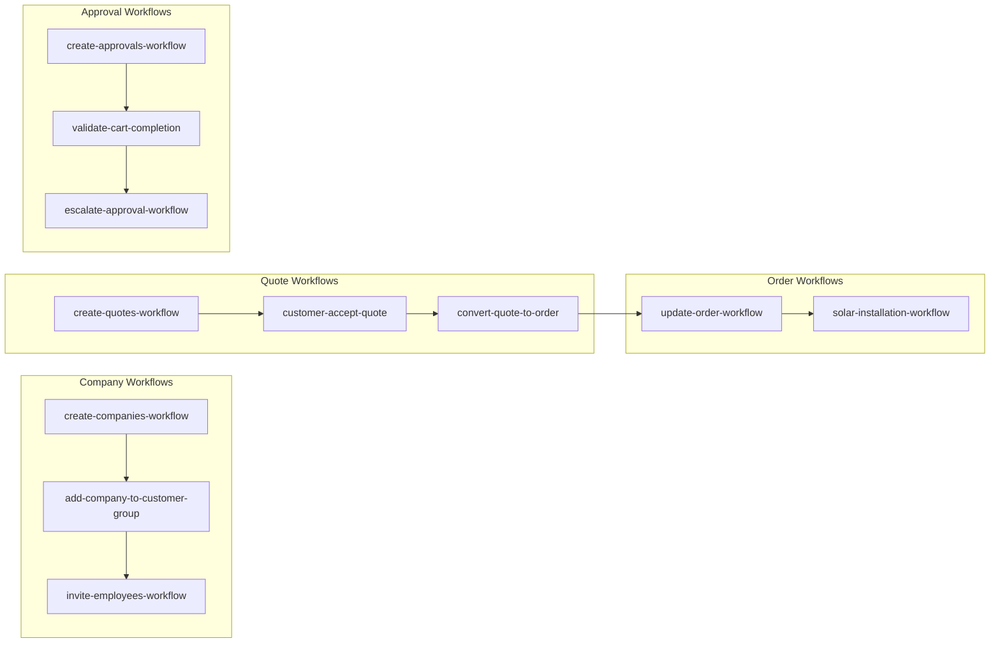

## Visão Geral da Arquitetura

O repositório Yello Solar Hub implementa um marketplace B2B completo para "Solar as a Service" utilizando Medusa.js v2.10.3 como plataforma de e-commerce, com Next.js 15 no frontend e módulos customizados para funcionalidades B2B específicas.

## Stack Tecnológico

- **Backend**: Medusa.js v2.10.3 (Framework de e-commerce)
- **Frontend**: Next.js 15 com App Router
- **Banco**: PostgreSQL 15
- **Cache**: Redis
- **Infraestrutura**: Docker, AWS ECS, CloudFormation
- **Testes**: Jest, Playwright, Vitest (FOSS stack)

## Estrutura de Diretórios

```text
backend/
├── src/
│   ├── api/                      # Rotas API (store/admin)
│   │   ├── store/                # APIs públicas da loja
│   │   │   ├── companies/        # Gestão de empresas B2B
│   │   │   ├── quotes/           # Sistema de cotações
│   │   │   ├── approvals/        # Workflows de aprovação
│   │   │   ├── solar-products/   # Produtos solares especializados
│   │   │   └── [countryCode]/    # Suporte multi-região
│   │   └── admin/                # APIs administrativas
│   │       ├── companies/        # Gestão de empresas
│   │       ├── employees/        # Gestão de funcionários
│   │       ├── quotes/           # Administração de cotações
│   │       ├── approvals/        # Configuração de aprovações
│   │       └── solar-compliance/ # Conformidade solar
│   ├── modules/                  # Módulos customizados B2B
│   │   ├── company/              # Módulo Empresa (CNPJ, funcionários)
│   │   ├── quote/                # Módulo Cotações (negociação)
│   │   ├── approval/             # Módulo Aprovações (workflow)
│   │   ├── solar-product/        # Módulo Produtos Solares
│   │   ├── compliance/           # Módulo Conformidade Regulatória
│   │   └── region/               # Módulo Multi-Região
│   ├── workflows/                # Workflows de negócio
│   │   ├── company/              # Workflows empresa
│   │   ├── quote/                # Workflows cotações
│   │   ├── approval/             # Workflows aprovação
│   │   ├── order/                # Workflows pedidos
│   │   └── hooks/                # Hooks de workflow
│   ├── links/                    # Links entre módulos
│   ├── types/                    # Tipos TypeScript compartilhados
│   └── utils/                    # Utilitários compartilhados
├── medusa-config.ts              # Configuração Medusa v2.10.3
├── package.json
└── tsconfig.json
```

## Módulos Customizados B2B

### 1. Company Module (Empresa)

**Responsabilidades:**

- Gestão de empresas B2B com CNPJ
- Funcionários e permissões
- Limites de gastos por empresa
- Grupos de clientes customizados

**Estrutura:**

```typescript
src/modules/company/
├── index.ts              # Exportação do módulo
├── service.ts            # Lógica de negócio
├── models/
│   ├── company.ts        # Modelo Company
│   └── employee.ts       # Modelo Employee
└── types/
    └── index.ts          # Tipos TypeScript
```

**APIs:**

- `POST /store/companies` - Criar empresa
- `GET /store/companies/:id` - Buscar empresa
- `POST /admin/companies/:id/employees` - Adicionar funcionário

### 2. Quote Module (Cotações)

**Responsabilidades:**

- Sistema de negociação de preços
- Mensagens entre comprador/vendedor
- Conversão de cotação para pedido
- Histórico de negociações

**APIs:**

- `POST /store/quotes` - Criar cotação
- `POST /store/quotes/:id/messages` - Enviar mensagem
- `POST /store/quotes/:id/accept` - Aceitar cotação

### 3. Approval Module (Aprovações)

**Responsabilidades:**

- Workflows de aprovação configuráveis
- Regras baseadas em valor/limite
- Escalação automática
- Audit trail completo

**APIs:**

- `POST /admin/companies/:id/approval-settings` - Configurar aprovações
- `GET /store/cart/approval-status` - Status de aprovação do carrinho

### 4. Solar Product Module (Produtos Solares)

**Responsabilidades:**

- Produtos especializados para energia solar
- Configurador de sistemas solares
- Cálculos de dimensionamento
- Conformidade regulatória

### 5. Compliance Module (Conformidade)

**Responsabilidades:**

- Validação de conformidade regulatória
- Certificações obrigatórias
- Requisitos regionais
- Relatórios de auditoria

## Workflows de Negócio



### Company Workflows

- **create-companies-workflow**: Criação de empresa com validação CNPJ
- **add-company-to-customer-group-workflow**: Vinculação empresa-grupo
- **invite-employees-workflow**: Convite de funcionários

### Quote Workflows

- **create-quotes-workflow**: Inicia processo de cotação
- **customer-accept-quote-workflow**: Aceitação por cliente
- **convert-quote-to-order-workflow**: Conversão para pedido

### Approval Workflows

- **create-approvals-workflow**: Cria workflow de aprovação
- **validate-cart-completion-workflow**: Valida conclusão do carrinho
- **escalate-approval-workflow**: Escalação automática

### Order Workflows

- **update-order-workflow**: Atualização customizada de pedidos
- **solar-installation-workflow**: Workflow de instalação solar

## Links Entre Módulos

### Relacionamentos Essenciais

```typescript
// Empresa ↔ Grupo de Clientes
export default defineLink(
  CompanyModule.linkable.company,
  CustomerModule.linkable.customerGroup
);

// Funcionário ↔ Cliente
export default defineLink(
  EmployeeModule.linkable.employee,
  CustomerModule.linkable.customer
);

// Carrinho ↔ Aprovações
export default defineLink(
  CartModule.linkable.cart,
  ApprovalModule.linkable.approval
);

// Pedido ↔ Empresa
export default defineLink(
  OrderModule.linkable.order,
  CompanyModule.linkable.company
);

// Produto ↔ Conformidade
export default defineLink(
  ProductModule.linkable.product,
  ComplianceModule.linkable.compliance
);
```

## Configuração Medusa v2.10.3

### medusa-config.ts

```typescript
import { defineConfig } from "@medusajs/framework/utils";

export default defineConfig({
  projectConfig: {
    databaseUrl: process.env.DATABASE_URL,
    redisUrl: process.env.REDIS_URL,
    http: {
      storeCors: process.env.STORE_CORS,
      adminCors: process.env.ADMIN_CORS,
      authCors: process.env.AUTH_CORS,
    },
  },

  modules: {
    [COMPANY_MODULE]: { resolve: "./modules/company" },
    [QUOTE_MODULE]: { resolve: "./modules/quote" },
    [APPROVAL_MODULE]: { resolve: "./modules/approval" },
    [SOLAR_PRODUCT_MODULE]: { resolve: "./modules/solar-product" },
    [COMPLIANCE_MODULE]: { resolve: "./modules/compliance" },
  },

  featureFlags: {
    view_configurations: true,  // Experimental v2.10.3
  },
});
```

## Funcionalidades do Marketplace

### 1. Portal Empresa B2B

- Cadastro de empresa com CNPJ
- Gestão de funcionários e permissões
- Configuração de limites de gastos
- Portal de aprovações

### 2. Sistema de Cotações

- Solicitação de cotação para produtos
- Negociação em tempo real
- Conversão automática para pedido
- Histórico completo

### 3. Workflows de Aprovação

- Regras configuráveis por empresa
- Escalação automática
- Bloqueio de checkout até aprovação
- Audit trail

### 4. Produtos Solares Especializados

- Paineis solares, inversores, estruturas
- Configurador de sistemas
- Cálculos de dimensionamento
- Conformidade regulatória

### 5. Suporte Multi-Região

- URLs por país: `/br/`, `/us/`, `/eu/`
- Moedas e idiomas locais
- Regras regulatórias regionais
- Conformidade local

## Estratégia de Desenvolvimento

### Princípios Arquiteturais

1. **Modularidade**: Cada funcionalidade B2B em módulo separado
2. **Workflow-driven**: Toda lógica de negócio em workflows
3. **Link-based**: Relacionamentos via links, não FKs diretas
4. **Server-first**: Server Components e Server Actions prioritários
5. **Type-safe**: TypeScript rigoroso em toda aplicação

### Convenções de Código

**Backend**:

- Kebab-case para arquivos: `create-companies-workflow.ts`
- PascalCase para classes: `CompanyModuleService`
- Interfaces em arquivos `types/`
- Utilitários em `utils/`

### Estratégia de Testes

- **Backend**: Jest para unitários e integração
- **API**: Testes HTTP automatizados
- **Workflows**: Testes de integração completos

## Segurança e Conformidade

### Autenticação B2B

- JWT com claims customizados
- Roles por empresa/usuário
- MFA para operações críticas
- Sessões seguras

### Conformidade Regulatória

- LGPD/GDPR compliance
- Auditoria de dados
- Conformidade solar por região
- Certificações obrigatórias

---

Esta estrutura definitiva consolida todas as funcionalidades do marketplace Yello Solar Hub em uma arquitetura coesa, escalável e mantível, seguindo as melhores práticas do Medusa.js v2.10.3.
