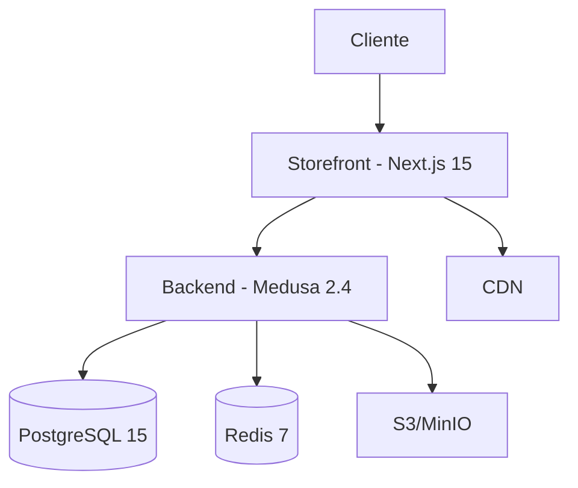

# Visão Geral da Arquitetura

O YSH B2B Platform é construído sobre uma arquitetura moderna de e-commerce com separação clara entre backend, frontend e infraestrutura.

## 🏗️ Componentes Principais



### Storefront (Frontend)

**Next.js 15** com App Router e Server Components

- **Rotas Multi-Região**: `app/[countryCode]/`
- **Módulos por Recurso**: account, cart, checkout, products, quotes
- **Server Actions**: Busca de dados otimizada
- **Componentes**: 80+ componentes UI (Server + Client)

[Ver detalhes completos →](../architecture/storefront/overview.md)

### Backend (Medusa.js)

**Medusa 2.4** com módulos B2B customizados

- **Módulos Core**: Company, Quote, Approval, Solar
- **Workflows**: 12+ workflows de negócio orquestrados
- **APIs**: 25+ rotas custom além das rotas Medusa core
- **Links de Módulo**: Relacionamentos entre entidades

[Ver estrutura completa →](../architecture/backend/structure.md)

### Infraestrutura

**Stack FOSS 100%** - 15+ serviços open source

- **Database**: PostgreSQL 15 + pgBouncer
- **Cache**: Redis 7 Sentinel
- **Storage**: MinIO (S3-compatible)
- **Observability**: Prometheus + Grafana + Jaeger + Loki
- **Security**: Vault + Keycloak + NGINX WAF

[Ver stack completa →](../architecture/infrastructure/foss-stack-complete.md)

## 📊 Stack Tecnológico

| Camada | Tecnologia | Versão |
|--------|-----------|--------|
| **Frontend** | Next.js | 15.5.4 |
| | React | 19.1.0 |
| | TypeScript | 5.5.3 |
| **Backend** | Medusa.js | 2.4 |
| | Node.js | 20 LTS |
| **Database** | PostgreSQL | 15.7 |
| | Redis | 7.1 |
| **Infra** | Docker | 24+ |
| | Kubernetes | 1.28+ (opcional) |

## 🔄 Fluxo de Dados

### 1. Jornada de Compra B2B

```
Cliente → Storefront → Medusa Backend → Database
                ↓
         Workflow de Aprovação
                ↓
            Conversão para Pedido
```

### 2. Sistema de Cotações

```
Solicitação → Quote Module → Aprovações → Conversão
     ↓              ↓            ↓            ↓
  Frontend      Workflows    Approval     Order
                                Module      Module
```

### 3. Produtos Solares

```
Catálogo → Dimensionamento → Viabilidade → Proposta
   ↓            ↓                ↓            ↓
Products    Solar Module    ROI Service   Quote/PDF
```

## 🎯 Princípios Arquiteturais

### 1. **Modularidade**
Cada funcionalidade B2B em módulo separado e independente

### 2. **Workflow-driven**
Toda lógica de negócio implementada via workflows Medusa

### 3. **Link-based**
Relacionamentos entre módulos via `defineLink()`, não FKs diretas

### 4. **Server-first**
Server Components e Server Actions como padrão

### 5. **Type-safe**
TypeScript rigoroso em toda a aplicação

## 📈 Escalabilidade

### Horizontal Scaling

- **Frontend**: Edge deployment (Vercel/Cloudflare)
- **Backend**: ECS Fargate com auto-scaling
- **Database**: Read replicas PostgreSQL
- **Cache**: Redis Cluster/Sentinel

### Performance

- **LCP**: &lt;2.3s (otimizado)
- **FCP**: &lt;1.7s (preload de fontes)
- **CLS**: &lt;0.05 (estável)
- **INP**: &lt;200ms (responsivo)

## 🔒 Segurança

- **CSP**: `object-src 'none'`, `frame-ancestors 'none'`
- **Headers**: HSTS, X-Frame-Options, Permissions-Policy
- **Auth**: JWT + Secure cookies
- **Secrets**: Vault para gerenciamento

## 📚 Documentação Detalhada

### Backend
- [Estrutura Definitiva](../architecture/backend/structure.md)
- [Módulos B2B](../architecture/backend/modules.md)
- [Workflows](../architecture/backend/workflows.md)
- [APIs](../architecture/backend/apis.md)

### Storefront
- [Visão Geral](../architecture/storefront/overview.md)
- [App Router](../architecture/storefront/app-router.md)
- [Componentes](../architecture/storefront/components.md)
- [Padrões](../architecture/storefront/patterns.md)

### Infraestrutura
- [Stack FOSS Completa](../architecture/infrastructure/foss-stack-complete.md)
- [Guia Visual](../architecture/infrastructure/foss-stack-visual.md)
- [Escalabilidade](../architecture/infrastructure/scalability.md)

---

**Próximo**: [Setup Local com Docker](../quickstart/local/docker-setup.md) →
